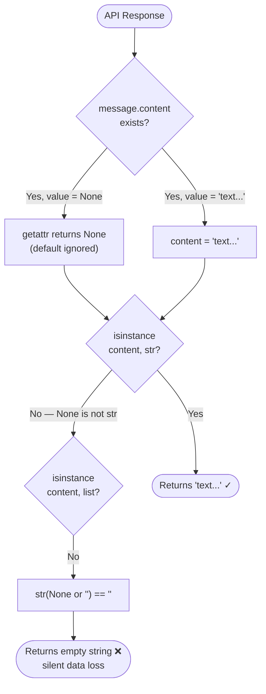
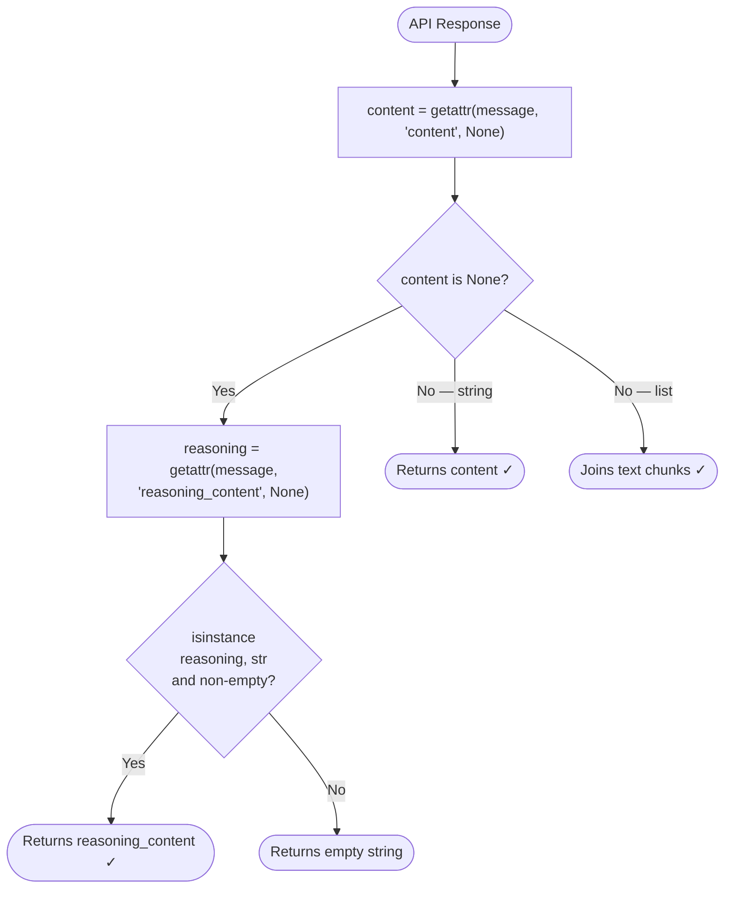
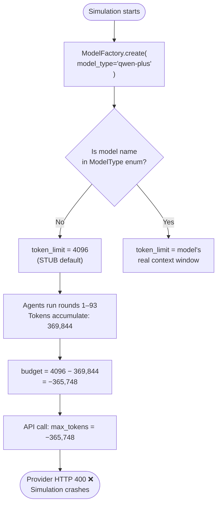
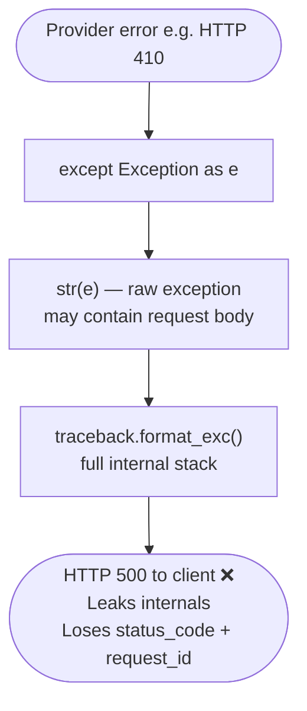
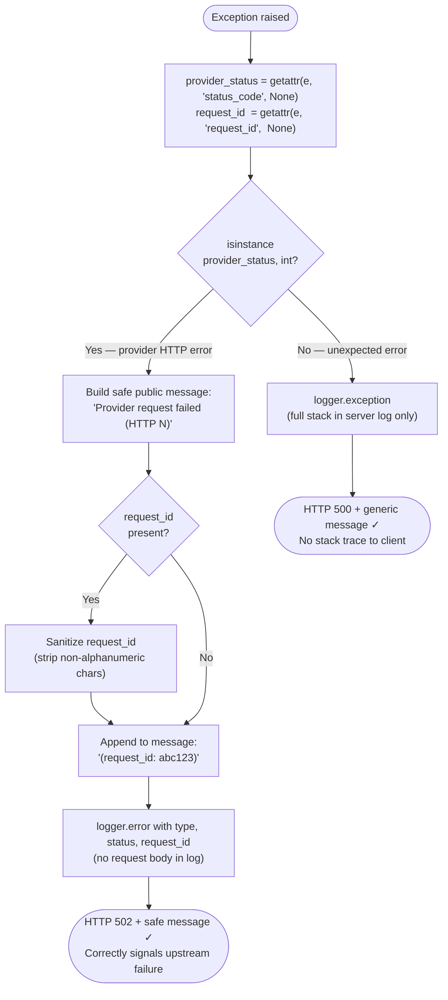

# Issue #814 — Three LLM Call-Stack Bugs: Root Cause & Fix

**Upstream issue:** [666ghj/MiroFish#814](https://github.com/666ghj/MiroFish/issues/814)  
**PR:** [666ghj/MiroFish#841](https://github.com/666ghj/MiroFish/pull/841)  
**Labels:** `help wanted`, `LLM API`

---

## Table of Contents

1. [Bug 1 — Reasoning model output silently discarded](#bug-1--reasoning-model-output-silently-discarded)
2. [Bug 2 — Negative `max_tokens` crashes long simulations](#bug-2--negative-max_tokens-crashes-long-simulations)
3. [Bug 3 — Bare `except` blocks swallow provider error details](#bug-3--bare-except-blocks-swallow-provider-error-details)
4. [Files Changed](#files-changed)
5. [Testing](#testing)

---

## Bug 1 — Reasoning model output silently discarded

### Symptom

When using a reasoning model (e.g. DeepSeek-R1, NVIDIA NIM reasoning endpoints), every report section comes back blank — no error, no warning, just empty content.

### How reasoning models respond differently

Standard models place their output in `message.content`. Reasoning models split their response into two fields:

| Field | Standard models | Reasoning models |
|---|---|---|
| `message.content` | `"The analysis shows..."` | `None` |
| `message.reasoning_content` | *(absent)* | `"The analysis shows..."` |

### Root Cause

**File:** `backend/app/utils/openai_chat_compat.py`, line 70

```python
# BEFORE — broken
content = getattr(message, "content", "")
```

The Python `getattr(obj, name, default)` default only fires when the **attribute does not exist**. When a reasoning model returns `content=None`, the attribute *exists* — it just holds `None`. The default `""` is never used.

`None` then falls through to the last line of the function:

```python
return str(content or "")   # str(None or "") == ""  →  silent empty string
```

The result: every call to a reasoning model returns `""` with no exception raised.

### Flow: Before Fix (broken)



### Flow: After Fix (correct)



### Code Change

```diff
- content = getattr(message, "content", "")
+ content = getattr(message, "content", None)
+
+ if content is None:
+     # Reasoning models (e.g. DeepSeek-R1) set content=None and place
+     # their output in reasoning_content instead.
+     reasoning = getattr(message, "reasoning_content", None)
+     if isinstance(reasoning, str) and reasoning:
+         return reasoning
+     return ""
```

---

## Bug 2 — Negative `max_tokens` crashes long simulations

### Symptom

Simulation crashes at round ~94/120 with a provider HTTP 400:

```
Invalid value for 'max_tokens': -365748. Expected a value >= 1.
```

### Background: how camel-ai tracks the token budget

camel-ai's `BaseModelBackend` has a `token_limit` property used as the per-agent context budget ceiling:

```python
@property
def token_limit(self) -> int:
    return (
        self.model_config_dict.get("max_tokens")   # explicit config, or…
        or self.model_type.token_limit              # …enum default
    )
```

When `model_type` is an **unrecognised string** (e.g. `"qwen-plus"`, `"deepseek-chat"`), camel-ai maps it to `ModelType.STUB`, whose default `token_limit` is **4096**. Over many simulation rounds each agent accumulates tokens; when the total exceeds 4096 the budget goes negative.

### The arithmetic

```
token_limit (camel-ai default)  =     4,096
accumulated tokens (round 94)   =   369,844
─────────────────────────────────────────────
max_tokens sent to provider     =  -365,748  ← HTTP 400
```

### Flow: Before Fix (broken)



### Flow: After Fix (correct)

```mermaid
flowchart TD
    A([Simulation starts]) --> B["Read LLM_CONTEXT_WINDOW env var\n(default: 65536)"]
    B --> C["ModelFactory.create(\n  model_type='qwen-plus',\n  model_config_dict={'max_tokens': 65536}\n)"]
    C --> D["token_limit = 65536\n(from model_config_dict)"]
    D --> E["Agents run rounds 1–120\nTokens accumulate: 369,844"]
    E --> F["budget = 65536 − 369,844\n= −304,308 still negative?"]
    F -->|camel-ai clamps with max(0, remaining)| G["Context truncated gracefully"]
    G --> H([Simulation completes ✓])

    style F fill:#fff3cd,stroke:#ffc107
    style G fill:#d4edda,stroke:#28a745
```

> **Note:** Setting `max_tokens` in `model_config_dict` also serves as the per-call output ceiling for the API request. A value of 65536 is large enough that it does not truncate typical agent responses. Adjust `LLM_CONTEXT_WINDOW` in `.env` to match your model's actual context window.

### Code Change

```diff
+ context_window = int(os.environ.get("LLM_CONTEXT_WINDOW", "65536"))
  return ModelFactory.create(
      model_platform=ModelPlatformType.OPENAI,
      model_type=llm_model,
+     model_config_dict={"max_tokens": context_window},
  )
```

Applied to all three runner scripts:
- `backend/scripts/run_parallel_simulation.py`
- `backend/scripts/run_twitter_simulation.py`
- `backend/scripts/run_reddit_simulation.py`

### New environment variable

```env
# .env.example
# Sets the token budget for camel-ai agents and the per-call output ceiling.
# Must match your model's actual context window.
# Default: 65536. Use 131072 for 128k models (qwen-max, deepseek-chat, etc.)
# LLM_CONTEXT_WINDOW=65536
```

---

## Bug 3 — Bare `except` blocks swallow provider error details

### Symptom

Any provider error (deprecated model returning 410, rate limit 429, bad request 400) surfaces to the API client as a generic HTTP 500:

```json
{
  "success": false,
  "error": "Error code: 410 - {'type': 'about:blank', 'title': 'Gone', ...}",
  "traceback": "Traceback (most recent call last):\n  File \"...\"\n    ..."
}
```

- The `status_code` and `request_id` that identify the exact provider failure are absent from the response
- The raw exception string may echo request content back to the client
- The full Python stack trace is exposed to API consumers

### Root Cause

Four `except Exception` blocks in `backend/app/api/graph.py` all use the same pattern:

```python
# BEFORE — broken (repeated 4 times)
except Exception as e:
    return jsonify({
        "success": False,
        "error": str(e),                   # may contain request bodies
        "traceback": traceback.format_exc() # exposes internal stack to client
    }), 500
```

A correct provider-aware handler **already existed** in the same file (inside `generate_ontology`, line 394) but was never applied to the other endpoints.

### Flow: Before Fix (broken)



### Flow: After Fix (correct)



### Why 502 and not 500?

| Code | Meaning | When to use |
|---|---|---|
| `500` | Internal server error | The *server itself* failed unexpectedly |
| `502` | Bad gateway | The server received an invalid response from an **upstream** service |

A provider rejecting the request with 410/429/400 is an upstream failure. Returning 502 lets the caller distinguish "something is wrong with the LLM provider" from "something is wrong with MiroFish itself".

### Code Change (applied to 4 sites)

```diff
- except Exception as e:
-     return jsonify({
-         "success": False,
-         "error": str(e),
-         "traceback": traceback.format_exc()
-     }), 500
+ except Exception as e:
+     provider_status = getattr(e, "status_code", None)
+     request_id = getattr(e, "request_id", None)
+     if isinstance(provider_status, int):
+         public_error = f"Provider request failed (HTTP {provider_status})"
+         if request_id:
+             safe_id = re.sub(r"[^a-zA-Z0-9._:-]", "", str(request_id))[:128]
+             if safe_id:
+                 public_error += f" (request_id: {safe_id})"
+         logger.error(
+             "<endpoint> provider request failed: type=%s status=%s request_id=%s",
+             type(e).__name__, provider_status, request_id or "unknown",
+         )
+         return jsonify({"success": False, "error": public_error}), 502
+     logger.exception("Unexpected failure in <endpoint>")
+     return jsonify({"success": False, "error": "<safe message>; see server logs"}), 500
```

Applied at four locations in `backend/app/api/graph.py`:
- `build_task()` background thread — also writes `project.error` with the safe message
- `_build_graph_impl()` outer Flask handler
- `get_graph_data()` Flask handler
- `delete_graph()` Flask handler

---

## Files Changed

| File | Bug | Change |
|---|---|---|
| `backend/app/utils/openai_chat_compat.py` | 1 | `None`-guard + `reasoning_content` fallback |
| `backend/scripts/run_parallel_simulation.py` | 2 | Pass `model_config_dict` with `LLM_CONTEXT_WINDOW` |
| `backend/scripts/run_twitter_simulation.py` | 2 | Same |
| `backend/scripts/run_reddit_simulation.py` | 2 | Same |
| `.env.example` | 2 | Document `LLM_CONTEXT_WINDOW` |
| `backend/app/api/graph.py` | 3 | Provider-aware handler at 4 bare `except` sites |

---

## Testing

### Bug 1 — Reasoning model output
1. Configure a DeepSeek-R1 or NVIDIA reasoning endpoint in `.env`
2. Run a report generation
3. **Before fix:** all report sections are empty strings with no error
4. **After fix:** sections contain the model's actual analysis

### Bug 2 — Negative `max_tokens`
1. Run a 120-round simulation with an unrecognised model name (e.g. `qwen-plus`)
2. **Before fix:** crash at round ~94 — `Invalid value for 'max_tokens': -365748`
3. **After fix:** simulation completes all 120 rounds

Shortcut to reproduce early: set `LLM_CONTEXT_WINDOW=100` in `.env`. The budget exhausts in a handful of rounds and the context is truncated gracefully rather than triggering a provider 400.

### Bug 3 — Provider error surfacing
1. Use an expired or deprecated API key / model (e.g. a model that returns HTTP 410)
2. Trigger a graph build or data fetch
3. **Before fix:** `HTTP 500, {"error": "Error code: 410 - {raw body}", "traceback": "..."}`
4. **After fix:** `HTTP 502, {"error": "Provider request failed (HTTP 410) (request_id: abc123)"}`
