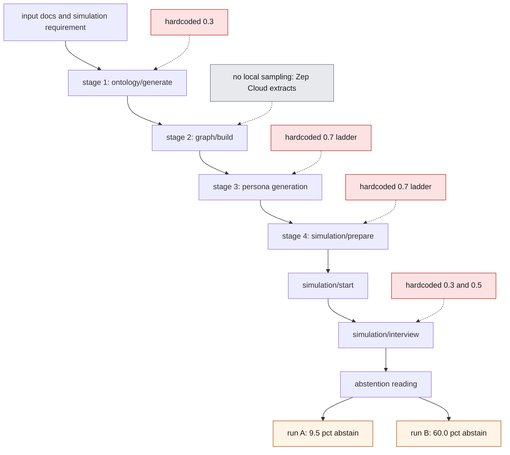
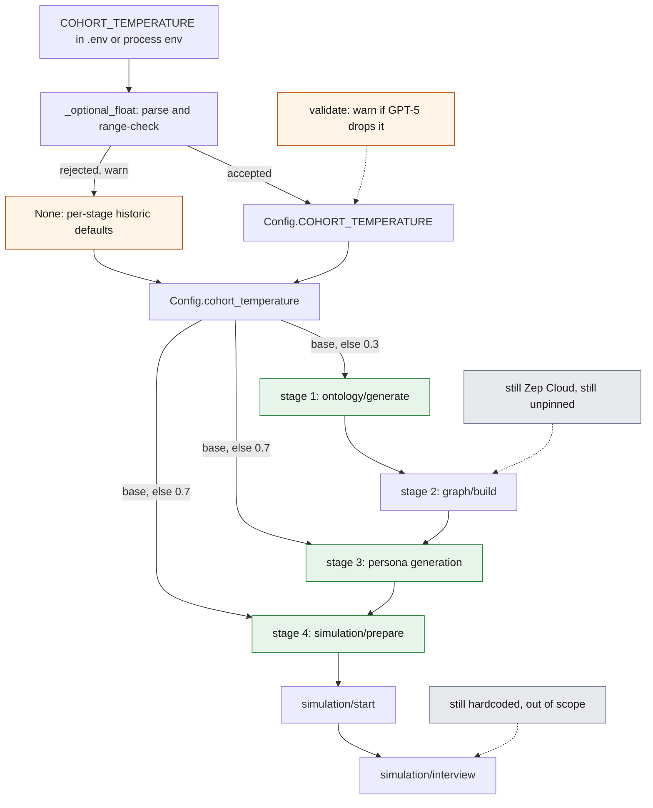
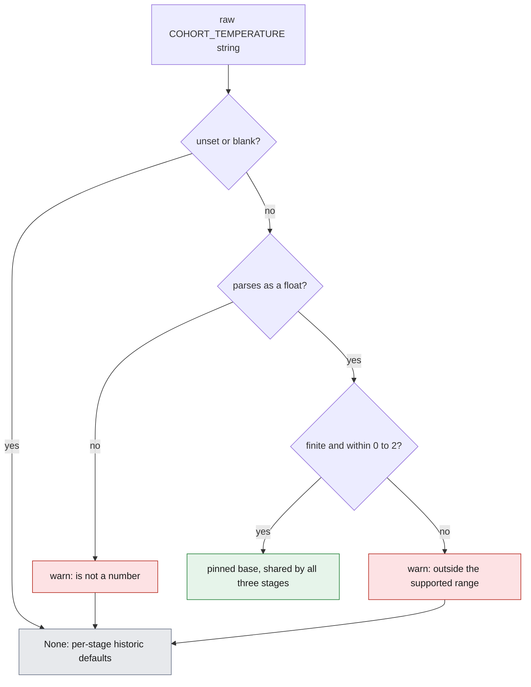
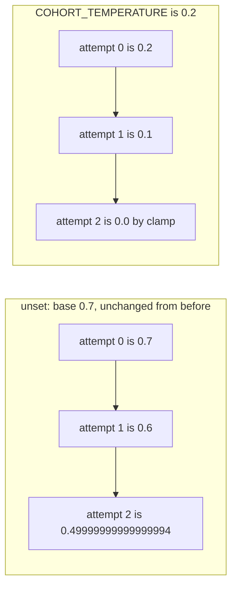

# Issue #751 — Make cohort-construction temperature configurable

## 1. The problem

Re-running MiroFish over the same input builds a *different crowd* every time. The
ontology comes back different, the entities come back different, and the personas
that get turned into agents come back different. For interactive use that is fine,
arguably even desirable. For anything that compares one run against another it means
the result is not reproducible, and nothing in the API surface says so.

The reporter of #751 measured it. Running the same event description repeatedly
through `graph/ontology/generate` → `graph/build` → `simulation/prepare` →
`simulation/start` → `simulation/interview`, with a **byte-identical interview
prompt**, gave **9.5% abstention on one run and 60.0% on another**. Same input, same
prompt, same code — a sixfold difference in the headline reading.

They traced it to three hardcoded sampling temperatures and asked for them to be made
configurable with today's values as defaults: unset keeps current behaviour, `0` gives
a reproducible cohort. They explicitly flagged a trap for whoever implemented it: both
persona-side call sites compute `0.7 - (attempt * 0.1)` to descend on retry, so a
configurable base of `0` would compute *negative* temperatures.

### What this fix does not achieve

The reporter followed up twice, and the second comment is a correction that bounds
this change. It is worth stating up front rather than burying it.

Their original claim was that with the temperatures at 0, "three of four subsequent
runs produced byte-identical persona rosters". That turned out to be a hash of persona
**names** only. Comparing the full `persona` field in `reddit_profiles.json` across
the same four builds:

| pair | `persona` field differs |
| --- | --- |
| 1 vs 2 / 3 / 4 | 19/19 |
| 2 vs 3 | 3/20 |
| 2 vs 4 | 3/20 |
| 3 vs 4 | **0/20** |

Only the 3-vs-4 pair had identical personas. The names were stable; the descriptions
that actually define each agent's viewpoint were not. Worse, the pair with *identical*
personas differed by 0.2481 in the final probability reading while the closest pair
(0.0393) had three personas differing — identical names do not imply identical people,
and identical people did not produce identical readings.

They also measured that with all the cohort temperatures at 0, two consecutive
`ontology/generate` + `graph/build` in the **same container** still produce different
entity sets — 27 vs 26 entities, 24 shared. And separately, that determinisation holds
only within one container lifetime: the first build after a restart often yields a
different roster, including a different persona count. They did not identify the cause
and did not assert one.

Their conclusion, quoted because it is the right framing: *"if the change ships
described as 'reproducible cohorts', that description will not hold in practice."*

So the honest scope of this change is: **it removes the three hardcoded local sampling
points as a source of run-to-run churn, and gives operators one knob to pin them.** It
does not make cohort construction reproducible end to end, because the entity
extraction step between ontology and persona generation does not run locally at all
(see section 2). Treat it as a prerequisite for reproducibility work, not as the whole
of it.

That measurement is the reason the shipped wording says what it says. An earlier draft
of this change described `COHORT_TEMPERATURE=0` as giving "a reproducible cohort" in
`.env.example` and in the `config.py` comment — which is exactly the description the
reporter had already measured to be false and asked not to be used. Both now say the
setting pins the three local sampling points and take care to add that this is *not*
the same as a reproducible cohort, naming Zep-side extraction as the remaining source
and citing the 27-vs-26 measurement. The code and the claim agree.

## 2. Root cause

Three separate LLM calls on the cohort-construction chain each carried their own
hardcoded temperature literal, with no way to reach any of them from configuration.
Against `origin/main`:

| stage | site | literal |
| --- | --- | --- |
| ontology generation | `backend/app/services/ontology_generator.py:237` | `temperature=0.3,` |
| persona generation | `backend/app/services/oasis_profile_generator.py:581` | `temperature=0.7 - (attempt * 0.1),` |
| simulation config generation | `backend/app/services/simulation_config_generator.py:452` | `temperature=0.7 - (attempt * 0.1),` |

Two aggravating details:

**The third site is easy to miss.** It lives inside
`SimulationConfigGenerator._call_llm_with_retry` (`simulation_config_generator.py:435`,
loop at `:442`) and is reached via `SimulationManager.prepare_simulation()`. The
reporter missed it on a first pass that only grepped the files already known to be on
the path; a grep for "temperature" across `backend/app/services/` is what surfaces it.

**The retry ladders are descending, deliberately.** Both persona-side sites run
`max_attempts = 3` (`oasis_profile_generator.py:568`,
`simulation_config_generator.py:439`) and lower the temperature by 0.1 per attempt,
annotated `# 每次重试降低温度`, because a cooler sample is more likely to come back as
parseable JSON. Any change that makes the base configurable inherits that arithmetic,
which is where the negative-temperature trap comes from.

**Why pinning these three is not sufficient.** `backend/app/services/graph_builder.py`
contains **no** local LLM call — grep it for `temperature` or `chat.completions` and
you get zero hits. It submits text to Zep Cloud as `BatchAddItem`
(`graph_builder.py:471`) and reads the extracted nodes back
(`graph_builder.py:550`, `:587`). Entity extraction therefore happens server-side,
outside anything this repo can pin, and the entity summaries it returns are fed
straight into the persona prompt
(`oasis_profile_generator.py:559-561` →
`_build_individual_persona_prompt(entity_name, entity_type, entity_summary, ...)`).
Different summaries produce different persona text even at temperature 0. That is the
structural explanation for the reporter's correction in section 1.

## 3. Flow before the fix

Every stage marked in red sampled at a temperature that existed only as a literal in
the source. Three of them are cohort construction; the interview stage has three more
of its own. Nothing on this chain could be influenced from `.env`, so two runs of the
same input diverged at the first stage and kept diverging.



The chain is sequential, so the divergence compounds: a different ontology yields a
different entity set, which yields a different persona population, which yields a
different simulation config, which yields a different reading. By the time the
interview prompt is sent — byte-identical between runs — it is being sent to a
different crowd.

## 4. Flow after the fix

One setting, `COHORT_TEMPERATURE`, is read once in `backend/app/config.py` and resolved
per call through `Config.cohort_temperature(default, attempt)`. The three green stages
now share a single base value. Leave it unset and each stage falls back to the default
it has always used, so nothing changes for existing deployments.



The two grey annotations are the fix's boundary, not an oversight. `graph/build` has no
local temperature to pin, and the interview stage is left alone on purpose: per-agent
response variation there is the behaviour under study, not noise to be removed.

### The validation boundary

A configured value has to get past a gate before it can reach a provider request. This
exists because `float()` is far more permissive than the setting is: `'inf'`, `'-inf'`
and `'nan'` are legal float literals, `'1e400'` silently overflows to `inf`, and `'7'`
is indistinguishable from a deliberate choice when it is really `'0.7'` with the
decimal point missed.



Every rejection path lands on the same place the unset path lands on — the per-stage
historic defaults — so a mistyped value degrades to today's behaviour rather than to
something new. Nothing raises: one typo in `.env` must not stop the app from starting.

`[0, 2]` is the interval the OpenAI-compatible `temperature` parameter is specified
over, and MiroFish talks to OpenAI-format endpoints exclusively, so a value outside it
would be rejected by the provider anyway. The check only moves that failure to the
config boundary, where the message can name the variable.

One more gate sits outside `_optional_float`: `Config.validate()` warns when the
setting is configured *and* `LLM_MODEL_NAME` is a GPT-5-family model, because the
compatibility layer omits `temperature` entirely for those — correctly, since that API
rejects the parameter — which would otherwise make the setting a silent no-op.

### The retry ladder

The ladder keeps its shape and gains a floor. `cohort_temperature` still subtracts
`0.1 * attempt`, but the result is clamped with `max(0.0, ...)`, so a low base can
never send a negative temperature to the provider.



Two things about the unset ladder are worth being explicit about, because they are
what makes "nothing changes" a verifiable claim rather than a hope:

- The expression form is unchanged, so the third rung is still
  `0.49999999999999994`, not `0.5`. `0.7 - (2 * 0.1)` has never been exactly `0.5` in
  IEEE-754 double arithmetic, and the fix does not quietly round it into one.
- The clamp cannot alter the unset path, because `max_attempts = 3` at both sites means
  `attempt` only ever takes the values 0, 1 and 2. The old expression first goes
  negative at attempt 7, which is unreachable.

Clamping was chosen over special-casing a zero base. A base of 0 is already the most
reliable setting there is nothing left to descend toward. With the range check in
front of it, the clamp has exactly one job left: catching the rungs the ladder
arithmetic itself drives below zero, which a legitimate small base does — `0.05`
reaches `-0.05` on the third attempt. A negative *base* no longer gets this far; it is
rejected at the gate above rather than silently normalised to 0, which is the honest
treatment of a value nobody can have meant.

## 5. What changed

| file | change | rationale |
| --- | --- | --- |
| `backend/app/config.py` | `import math`; `_optional_float()` helper with required `minimum`/`maximum`; `COHORT_TEMPERATURE_MIN`/`MAX`; `COHORT_TEMPERATURE`; `COHORT_TEMPERATURE_RETRY_STEP`; `cohort_temperature()`; GPT-5 no-op warning in `validate()` | one place to read the setting, one place to validate it and one place to resolve it, so the three call sites cannot drift apart |
| `backend/app/services/ontology_generator.py` | `temperature=0.3` → `Config.cohort_temperature(0.3)`; added `from ..config import Config` | stage 1 of the chain; the only one of the three that did not already import `Config` |
| `backend/app/services/oasis_profile_generator.py` | `temperature=0.7 - (attempt * 0.1)` → `Config.cohort_temperature(0.7, attempt)` | stage 3; retry ladder preserved, now floored |
| `backend/app/services/simulation_config_generator.py` | same substitution | stage 4; the site reached via `prepare_simulation()` that is easy to miss |
| `.env.example` | documents the variable and its range, commented out, with the scope caveat | discoverability; an unset variable has to stay unset by default, and the caveat belongs where operators actually read it |
| `backend/tests/test_cohort_temperature_config.py` | new, 40 tests | asserts on the `temperature` kwarg actually reaching a stubbed client at all three sites, plus the validation boundary and the GPT-5 warning |

No other file is touched. In particular `locales/en.json` and `locales/zh.json` are
byte-unchanged: the two new messages are `warnings.warn` calls at the config boundary,
matching the convention already used there for `FLASK_DEBUG`, so no i18n keys were
needed.

The resolver is the whole of the sampling logic (`backend/app/config.py:107-136`):

```python
COHORT_TEMPERATURE_MIN = 0.0
COHORT_TEMPERATURE_MAX = 2.0
COHORT_TEMPERATURE = _optional_float(
    'COHORT_TEMPERATURE',
    minimum=COHORT_TEMPERATURE_MIN,
    maximum=COHORT_TEMPERATURE_MAX,
)
COHORT_TEMPERATURE_RETRY_STEP = 0.1

@classmethod
def cohort_temperature(cls, default: float, attempt: int = 0) -> float:
    base = cls.COHORT_TEMPERATURE
    if base is None:
        base = default
    return max(0.0, base - (attempt * cls.COHORT_TEMPERATURE_RETRY_STEP))
```

Unset is represented as `None` — "not configured" — rather than as a default number.
That is what lets the three differing historic values (0.3, 0.7, 0.7) survive
untouched: the default travels with the call site, not with the setting.

### The validation helper

`_optional_float` (`backend/app/config.py:18-52`) parses and range-checks, and never
raises — a mistyped temperature warns and falls back rather than refusing to start the
app:

```python
def _optional_float(key: str, *, minimum: float, maximum: float) -> float | None:
    ...
    try:
        value = float(raw)
    except ValueError:
        warnings.warn(f"{key}={raw!r} is not a number; ...", RuntimeWarning)
        return None

    if not math.isfinite(value) or not minimum <= value <= maximum:
        warnings.warn(
            f"{key}={raw!r} is outside the supported range "
            f"[{minimum}, {maximum}]; falling back to the built-in defaults.",
            RuntimeWarning,
        )
        return None

    return value
```

Two deliberate choices in that signature and body:

- **`minimum` and `maximum` are required keyword-only arguments.** A future caller
  cannot reach for this helper and accidentally inherit unbounded behaviour; the
  compiler makes them state a range. That is the point of the helper existing rather
  than the check being inlined once.
- **`math.isfinite` is redundant and kept anyway.** `nan` already fails
  `minimum <= value <= maximum`, since every comparison involving `nan` is false. But a
  reader has to re-derive IEEE-754 comparison semantics to see that, so the explicit
  finite check states the intent and lets the comment next to it be short.

### The GPT-5 warning, and why its import must be lazy

`Config.validate()` (`backend/app/config.py:151-163`) warns when the setting is
configured but the model will discard it:

```python
if cls.COHORT_TEMPERATURE is not None:
    # 延迟导入：app.utils 的包初始化会 import llm_client，而后者 import 本模块，
    # 放在模块顶层会形成循环导入。
    from .utils.openai_chat_compat import is_gpt5_family
    if is_gpt5_family(cls.LLM_MODEL_NAME):
        ...
```

The lazy import is load-bearing, not stylistic, and the reason is non-obvious enough to
be worth stating. `app/utils/__init__.py` imports `llm_client`, and
`app/utils/llm_client.py:12` does `from ..config import Config`. So importing anything
from the `app.utils` *package* while `app.config` is still executing its module body
re-enters `app.config` before `class Config` exists. Moving that import to the top of
`config.py` fails outright:

```
ImportError: cannot import name 'Config' from partially initialized module
'app.config' (most likely due to a circular import)
```

Deferring it into `validate()` sidesteps the cycle entirely, because by the time
anything calls `validate()` the module body has finished. It also matches what
`config.py` already does with `warnings`.

The call sites are one-liners. For example `oasis_profile_generator.py:581`:

```python
temperature=Config.cohort_temperature(0.7, attempt),  # 每次重试降低温度
```

The name is unprefixed to match the existing settings in `config.py` (`LLM_*`,
`ZEP_*`, `OASIS_*`, `REPORT_AGENT_*`). The issue suggested
`MIROFISH_COHORT_TEMPERATURE`, but the repo has no `MIROFISH_`-prefixed variables
today and one new prefixed key would be the odd one out.

## 6. Validation

```
cd backend && PYTHONPATH="$PWD" python -m pytest -q tests/
```

In the sandbox this was run as:

```
cd /workshop/microfish/wt/doc751/backend && \
PYTHONPATH=/workshop/microfish/wt/doc751/backend \
/workshop/microfish/repo/backend/.venv/bin/python -m pytest -q tests/
```

Results:

| tree | result |
| --- | --- |
| `origin/main` | `129 passed` |
| this branch | `169 passed in 3.79s` |

Plus `python -m compileall -q app tests run.py scripts`: clean.

40 tests, all in `backend/tests/test_cohort_temperature_config.py`. They stub the LLM
client and assert on the `temperature` kwarg actually passed at each of the three
sites, so no network and no provider call is involved.

### What the setting accepts and rejects

Measured against the shipped code, reading the resolved value and the full persona
ladder out of a fresh interpreter per case:

| raw value | `COHORT_TEMPERATURE` | ladder sent to the provider | warning |
| --- | --- | --- | --- |
| unset | `None` | `[0.7, 0.6, 0.49999999999999994]` | — |
| `0` | `0.0` | `[0.0, 0.0, 0.0]` | — |
| `0.05` | `0.05` | `[0.05, 0.0, 0.0]` | — |
| `0.2` | `0.2` | `[0.2, 0.1, 0.0]` | — |
| `0.7` | `0.7` | `[0.7, 0.6, 0.49999999999999994]` | — |
| `2` | `2.0` | `[2.0, 1.9, 1.8]` | — |
| `  0.5  ` | `0.5` | `[0.5, 0.4, 0.3]` | — |
| `inf`, `+inf`, `Infinity`, `1e400` | `None` | legacy `[0.7, 0.6, 0.49999999999999994]` | outside the supported range |
| `-inf`, `nan` | `None` | legacy | outside the supported range |
| `7`, `2.0001` | `None` | legacy | outside the supported range |
| `-1`, `-0.0001` | `None` | legacy | outside the supported range |
| `abc`, `0.3abc`, `0,3`, `low` | `None` | legacy | is not a number |

The `0.05` row is the clamp doing its real job: the ladder drives a legitimate small
base below zero on its own. `inf` is additionally verified end to end — with it
configured, all three stages are asserted to receive the historic defaults, which is
the regression guard for the behaviour described in section 8.

`Config.validate()` warns for `gpt-5`, `gpt-5-mini-2025-08-07` and `GPT-5-Turbo`
(the check is case-insensitive), and stays quiet for `qwen-plus`, `gpt-4o-mini`, and
for every model when the setting is unset.

### Which tests pass before as well as after

Four of the forty are regression guards for "nothing changes for existing users", and
they must pass against `origin/main` too. Running the test file against a clean
`origin/main` checkout with only that file copied in gives **4 passed, 36 failed**:

| test | params | on `main` | on this branch |
| --- | --- | --- | --- |
| `test_unset_keeps_ontology_temperature` | | pass | pass |
| `test_unset_keeps_persona_retry_ladder` | | pass | pass |
| `test_unset_keeps_simulation_config_retry_ladder` | | pass | pass |
| `test_validate_is_quiet_when_cohort_temperature_is_unset` | | pass | pass |
| `test_zero_pins_every_cohort_stage` | | fail | pass |
| `test_configured_base_steps_down_and_stops_at_zero` | | fail | pass |
| `test_no_retry_rung_is_ever_negative` | 4 | fail | pass |
| `test_env_value_reaches_the_cohort_stages` | | fail | pass |
| `test_missing_or_blank_env_value_keeps_legacy_defaults` | 3 | fail | pass |
| `test_unparsable_env_value_warns_and_keeps_legacy_defaults` | 4 | fail | pass |
| `test_out_of_range_env_value_warns_and_keeps_legacy_defaults` | 10 | fail | pass |
| `test_in_range_env_value_is_accepted_without_warning` | 6 | fail | pass |
| `test_rejected_value_never_reaches_a_cohort_stage` | | fail | pass |
| `test_validate_warns_when_the_model_drops_the_temperature` | 3 | fail | pass |
| `test_validate_is_quiet_for_models_that_honour_temperature` | 2 | fail | pass |

The fourth guard is worth a note: on `origin/main`, `validate()` has no cohort branch
at all, so "no warning when the setting is unset" is trivially true there — which is
precisely the property it is guarding. It passes for the right reason on both sides.

`test_no_retry_rung_is_ever_negative` lost its `-1.0` case in the course of adding the
range check. A negative base is now rejected at the config boundary rather than
silently normalised to 0, so it belongs in the rejection test instead; the clamp test
keeps `0`, `0.05`, `0.1` and `0.2`, which are the bases where the ladder arithmetic is
what drives a rung negative.

### The default-path assertions are load-bearing

The ladder's defaults are asserted against hardcoded literals
(`[0.7, 0.6, 0.49999999999999994]` and `0.3`) rather than by re-evaluating the old
expression, so drift fails loudly instead of silently agreeing with itself. Confirmed
by deliberately injecting five drifts into a scratch copy and checking each is caught:

| injected drift | result |
| --- | --- |
| ontology default `0.3` → `0.35` | 2 tests fail |
| wrap the resolver in `round(..., 10)`, making the third rung a clean `0.5` | 20 tests fail |
| ladder base `0.7` → `0.8` at both sites | 3 tests fail |
| widen the accepted range to `[0, 1000]` | 2 tests fail |
| disable the `validate()` GPT-5 branch | 3 tests fail |

### Bit-level check of the default path

`struct.pack('>d', x).hex()` for the old expression `0.7 - (attempt * 0.1)`, evaluated
verbatim as it appears on `origin/main`, against the value returned by the live
`Config.cohort_temperature(0.7, attempt)` — not a re-implementation of it — for every
attempt the loops can reach:

| attempt | value | old bits | new bits |
| --- | --- | --- | --- |
| 0 | `0.7` | `3fe6666666666666` | `3fe6666666666666` |
| 1 | `0.6` | `3fe3333333333333` | `3fe3333333333333` |
| 2 | `0.49999999999999994` | `3fdfffffffffffff` | `3fdfffffffffffff` |

Identical. The ontology site is identical too: `0.3` → `3fd3333333333333` both ways.
The first divergence is at attempt 7, where the old expression gives
`-1.1102230246251565e-16` and the new one gives `0.0` — unreachable, since both loops
are `max_attempts = 3`.

### Other checks run by hand

- `COHORT_TEMPERATURE` set to unset / `0` / `0.05` / `0.2` / `2` / `7` / `-1` / `inf` /
  `nan` / `1e400` / `banana` in the real process environment, asserting on the kwarg
  reaching a stubbed client at all three sites.
- `locales/en.json` and `locales/zh.json` are untouched by the diff; both parse, both
  have 648 keys, and the key sets are identical. No new i18n keys were needed.
- No circular import, under `app`, `app.config`, `app.utils`,
  `app.utils.openai_chat_compat`, each of the three service modules individually,
  `app.services.ontology_generator` imported *before* `app`, `create_app()`, and
  `run.py`. The lazy import in `validate()` is what makes this hold — see section 5 for
  the failure it avoids.
- Test isolation from a developer's `.env`: planted a project-root `.env` in a throwaway
  copy of the tree containing `COHORT_TEMPERATURE=0.9`, then `banana`, then `inf`, then
  `7`, then `LLM_MODEL_NAME=gpt-5` with `COHORT_TEMPERATURE=0`. `169 passed` in every
  case. The unset-path tests pin `Config.COHORT_TEMPERATURE` directly, the validate
  tests pin `LLM_MODEL_NAME` too, and the reload tests stub `dotenv.load_dotenv` and
  load `config.py` under a separate module name, so `sys.modules['app.config']` is
  never replaced.

### A note on verifying any of this yourself

The shared virtualenv has an editable install pointing at a *different* checkout
(`site-packages/_editable_impl_mirofish_backend.pth` → `/workshop/microfish/repo/backend`
in the sandbox this was developed in). Two ways to silently test the wrong tree:

- `python -I` implies `-E`, which drops `PYTHONPATH`, so `app` resolves through that
  `.pth` instead.
- `python -c` puts the current directory at the *front* of `sys.path`, ahead of
  `PYTHONPATH`, so a probe launched from the wrong directory picks that tree instead.

Both produce "no difference" results for the wrong reason. The documented `pytest`
invocation above is unaffected. Every ad-hoc measurement quoted in this document was
re-run with `assert module.__file__.startswith(<worktree>)` plus a
`hasattr(Config, 'COHORT_TEMPERATURE_MAX')` tripwire, so a misresolution fails loudly
rather than quietly agreeing.

## 7. Pull request description

Submitted upstream as PR #858 against `666ghj/MiroFish`. Reproduced verbatim, fenced
so its own `##` headings stay out of this document's outline:

```markdown
## Summary

- Add a single `COHORT_TEMPERATURE` setting covering all three cohort-construction sampling points: ontology generation, persona generation, and simulation-config generation.
- Leave it unset and nothing changes: each stage keeps its own current default (0.3 / 0.7 / 0.7), including the exact floating point values of the retry ladders.
- Set it to `0` and those three sampling points are pinned, which removes temperature as a source of run-to-run variance. That is a prerequisite for reproducible cohorts, not the whole of it — see "What this does not fix" below.
- Accept only finite values in `[0, 2]`; anything else warns and falls back to the current defaults rather than being passed through to the provider.
- Both retry ladders still step down 0.1 per attempt, but the result is clamped at 0, so a low base can never send a negative temperature to the provider.
- Warn from `Config.validate()` when the setting is configured but the selected model is a GPT-5-family one, because the compatibility layer drops `temperature` for those and the setting would otherwise be a silent no-op.
- Document the variable in `.env.example`.

## Why

Cohort construction is currently non-deterministic: the temperatures are hardcoded at three separate call sites, so every run over the same input builds a different crowd and nothing in the API surface hints at it. #751 reports a variance study where the same input, run twice through `graph/ontology/generate` → `graph/build` → `simulation/prepare` → `simulation/start` → `simulation/interview` with a byte-identical interview prompt, produced 9.5% vs 60.0% abstention. That makes before/after comparisons and bug reports hard to trust.

The third site is inside `SimulationConfigGenerator._call_llm_with_retry`, reached via `SimulationManager.prepare_simulation()`, and is easy to miss when grepping for temperatures.

On the ladder: the two retry sites compute `0.7 - (attempt * 0.1)` to descend toward more reliable JSON on retry. Making the base configurable while keeping that ladder means a base of 0 would compute negative temperatures. I kept the ladder and clamped it at 0 rather than special-casing the zero base, because 0 is already the most reliable setting there is nothing left to descend toward, and clamping also covers small bases — 0.05 would otherwise reach -0.05 on the third attempt. The expression form is unchanged, so the unset path is bit-identical — including the fact that the third rung has always been `0.49999999999999994` rather than `0.5`.

A single knob rather than one per stage: the three stages form one chain, and pinning one of them in isolation buys very little, so pinning should not require three variables. Unset is represented as "not configured" rather than as a default number, which is what lets the three differing current values survive untouched. Per-stage overrides can be added later on top of this without a breaking change.

The name is unprefixed to match the existing settings in `config.py` (`LLM_*`, `ZEP_*`, `OASIS_*`, `REPORT_AGENT_*`); the issue suggested `MIROFISH_COHORT_TEMPERATURE`, but the repo has no `MIROFISH_`-prefixed variables today and one new prefixed key would be the odd one out. Happy to rename if you'd rather have the prefix.

## What this does not fix

I want to be straight about the scope, because the issue reporter measured the limits themselves and I would rather state them than have you find them.

**Pinning these three temperatures does not give reproducible cohorts.** In their follow-up on #751 they measured that with the cohort temperatures at 0, two consecutive `ontology/generate` + `graph/build` in the *same container* still produced different entity sets — 27 vs 26 entities, 24 shared. And comparing the full `persona` field in `reddit_profiles.json` across four pinned builds, only one of the compared run-pairs matched (3 vs 4 at 0/20 differing; 2 vs 3 and 2 vs 4 at 3/20; run 1 differed from all three at 19/19). Their original "byte-identical rosters" claim turned out to be a hash of persona *names* only; the descriptions that actually define each agent's viewpoint still varied. Their words: *"if the change ships described as 'reproducible cohorts', that description will not hold in practice."*

The structural reason is visible in the tree: `graph_builder.py` makes no local LLM call at all — it submits text to Zep as `BatchAddItem` and reads the extracted nodes back. Entity extraction for stage 2 of the chain therefore happens server-side, where this setting has no reach, and the entity summaries it returns feed straight into the persona prompt. Different summaries produce different persona text even at temperature 0. So the remaining variance sits in the extraction layer, outside this setting. I have worded `.env.example` and the `config.py` comment accordingly rather than promising reproducibility.

**The interview stage is deliberately untouched**, and that bounds the issue's headline metric. Per-agent response variation there is the interesting part, so I left it alone — but `zep_tools.py` also samples at hardcoded temperatures for agent *selection* (`:1609`, 0.3), question generation (`:1668`, 0.5) and summarisation (`:1726`, 0.3), and the first two are measurement apparatus rather than the thing being measured. The 9.5%-vs-60.0% abstention figure therefore stays unreproducible even with `COHORT_TEMPERATURE=0`. Worth a separate issue if you want it; I did not want to widen this one. Report temperatures are untouched for the same reason.

## On validating the value

`float()` accepts more than you would want here. `'inf'`, `'-inf'` and `'nan'` are legal literals, `'1e400'` silently overflows to `inf`, and `'7'` is just `'0.7'` with the decimal point missed. None of those are temperatures, and the `max(0.0, ...)` clamp only guards the bottom, so `inf` would previously have gone into the request unchanged.

That matters more than it looks, because the persona site catches bare `Exception`, logs a warning truncated to 80 characters, and falls back to `_generate_profile_rule_based` — so a mistyped temperature would quietly replace every agent in the cohort with a rule-based placeholder while the caller still saw success. (I have left that fallback alone; it is pre-existing behaviour and not this PR's business.) A range check at the config boundary is the cheap fix: `[0, 2]` is the range the OpenAI-compatible `temperature` parameter is specified over, and MiroFish talks to OpenAI-format endpoints exclusively, so anything outside it would be rejected by the provider anyway. Out-of-range and unparsable values both warn and fall back to the current defaults instead of raising, so one typo cannot stop the app from starting.

One caveat on that, since this PR now leans on the warning channel more than before: `_optional_float` runs at import time, and `warnings.warn` therefore fires before `create_app()` has set up the application logger, so the message lands on stderr rather than in the app log. In a container that only ships the app log, a rejected value would fall back to the current defaults with no visible signal. I kept `warnings.warn` because that is what `config.py` already does for `FLASK_DEBUG`, and because raising at import over one typo seemed worse — but if you would rather these went through the logger, say so and I will route them.

The GPT-5 warning is the same idea one layer up. `openai_chat_compat.create_chat_completion` omits `temperature` entirely for GPT-5-family models, which is correct — that API rejects the parameter — but it means `COHORT_TEMPERATURE=0` on `gpt-5-mini` silently does nothing at all. `Config.validate()` now says so. I did not change the transport-layer behaviour.

## Validation

- `backend/tests/test_cohort_temperature_config.py` (40 tests). It stubs the LLM client and asserts on the `temperature` kwarg actually passed at each of the three sites; no network or LLM calls. Coverage: the unset path at all three sites including every rung of both ladders; a configured base of `0` giving `0` on every rung; `0.2` giving `[0.2, 0.1, 0.0]`; no rung ever negative for bases `0 / 0.05 / 0.1 / 0.2`; in-range values (`0 / 0.05 / 0.2 / 0.7 / 2`, plus surrounding whitespace) accepted with no warning; every rejected form (`inf / +inf / Infinity / 1e400 / -inf / nan / 7 / 2.0001 / -1 / -0.0001`) and every unparsable form (`abc / 0.3abc / 0,3 / low`) warning and falling back to the current defaults; `inf` specifically verified end to end as never reaching any of the three stages; and the GPT-5 warning firing for `gpt-5`, `gpt-5-mini-2025-08-07` and `GPT-5-Turbo` while staying quiet for `qwen-plus`, `gpt-4o-mini`, and for any model when the setting is unset.
- Four of those tests pass against `main` as well as against this branch, which is the regression guard for "nothing changes for existing users": the three unset-path ones plus the "no GPT-5 warning when the setting is unset" one. The other 36 fail on `main` and pass here.
- The ladder's default values are asserted against hardcoded literals rather than by re-evaluating the old expression, so drift in the default path fails loudly instead of silently agreeing with itself. Checked by injecting drift deliberately: changing the ontology default from `0.3` to `0.35`, rounding the ladder so the third rung becomes a clean `0.5`, and moving the ladder base from `0.7` to `0.8` each produce the expected failures.
- Full backend suite: `169 passed` (129 before this change, plus the 40 new ones). `python -m compileall` clean over `app`, `tests`, `run.py` and `scripts`.
- Bit-level check of the unset path against the `main` expression, comparing `struct.pack('>d', x).hex()` for every attempt the loops can reach: `0.7` → `3fe6666666666666`, `0.6` → `3fe3333333333333`, `0.49999999999999994` → `3fdfffffffffffff`, and the ontology site's `0.3` → `3fd3333333333333`. Identical both sides. Both ladders are `max_attempts = 3`, so the clamp cannot touch the unset path — the old expression first goes negative at attempt 7.
- Also checked by hand with `COHORT_TEMPERATURE` unset / `0` / `0.05` / `0.2` / `2` / `7` / `-1` / `inf` / `nan` / `1e400` / `banana` set in the real process environment, asserting on the kwarg reaching the stubbed client at all three sites.
- No circular import from the new `from ..config import Config` in `ontology_generator.py`, under `app`, `app.config`, each service module individually, `ontology_generator` imported before `app`, `create_app()` and `run.py`. The GPT-5 check in `validate()` imports `openai_chat_compat` lazily on purpose: `app/utils/__init__.py` imports `llm_client`, which imports `..config`, so a module-level import there fails with `ImportError: cannot import name 'Config' from partially initialized module 'app.config'`.

One thing I noticed while in `config.py` but deliberately did not touch: `REPORT_AGENT_TEMPERATURE` has no reader anywhere in the repo (`report_agent.py` hardcodes its temperatures), and `REPORT_AGENT_MAX_TOOL_CALLS`, `REPORT_AGENT_MAX_REFLECTION_ROUNDS` and `OASIS_DEFAULT_MAX_ROUNDS` look the same. That's #779's territory and already has a PR open, so I left all four alone.

Fixes #751
```

## 8. Known gaps / review notes

An adversarial review of this change raised six points. Three were defects and are
fixed; three are bounds on what the change does, and remain true of what ships. This
section is the short list of what is *still* open — a reader should be able to tell
from it alone what is and is not addressed.

### Still open

#### 8.1 A rejected value warns to stderr, not into the application log

`_optional_float` reports both rejection paths through `warnings.warn`
(`backend/app/config.py:36-39` for unparsable, `:45-49` for out-of-range). Those fire
at **import** time: `backend/app/__init__.py:15` imports `.config` at module level,
while `setup_logger('mirofish')` only runs inside `create_app`
(`backend/app/__init__.py:30`). The message therefore goes to stderr through the
warnings machinery and never reaches the application log. In a container that ships
only the app log, a mistyped `COHORT_TEMPERATURE` silently reverts to the historic
defaults with no visible signal.

This matters a little more now than it did before the range check, because more inputs
take a warn-and-fall-back path. It is also inconsistent with the rest of `config.py`,
where a malformed value crashes at import — `OASIS_DEFAULT_MAX_ROUNDS`
(`config.py:83`) and `REPORT_AGENT_TEMPERATURE` (`config.py:99`) use bare `int()` and
`float()`. The "do not refuse to start over one typo" choice is deliberate and
documented in the helper's docstring, and `warnings.warn` matches what `config.py`
already does for `FLASK_DEBUG`; the weakness is the visibility, not the fallback.
Routing both messages through the logger would close it, at the cost of making
`config.py` depend on logging setup order. Raised in the PR body for the maintainer to
decide.

#### 8.2 The issue's headline metric is still not reproducible

The evidence in #751 is an interview abstention rate, measured through
`simulation/interview`. That path has three further hardcoded temperatures this change
deliberately does not touch:

| site | value | function |
| --- | --- | --- |
| `backend/app/services/zep_tools.py:1609` | `0.3` | `_select_agents_for_interview` — chooses *which* agents are interviewed |
| `backend/app/services/zep_tools.py:1668` | `0.5` | `_generate_interview_questions` |
| `backend/app/services/zep_tools.py:1726` | `0.3` | `_generate_interview_summary` |

Leaving the interview alone is the right scope call for *agent responses* — that
variation is the behaviour under study. But agent selection and question generation are
measurement apparatus rather than the thing being measured, so the 9.5%-vs-60.0%
figure stays unreproducible even with `COHORT_TEMPERATURE=0`. Not a defect in this
change; stated so the PR is not read as closing the measurement gap. Worth a separate
issue if anyone wants the apparatus pinned.

#### 8.3 Zep-side extraction remains the dominant source of variance

This is the bound described at length in sections 1 and 2, repeated here because it is
the thing most likely to be mistaken for a bug in this setting.
`backend/app/services/graph_builder.py` makes no local LLM call, so `graph/build` has
no temperature to pin; with everything at 0 the reporter still measured 27 vs 26
entities with 24 shared, in the same container. Nothing in this change can move that.
#759 is where it is being tracked.

#### 8.4 Two sources of truth for the value (latent)

`backend/app/__init__.py:22` does `app.config.from_object(config_class)`, which copies
`COHORT_TEMPERATURE` into `app.config`, but all three call sites read the `Config`
class directly. Verified:

- `create_app(TestConfig)` where `TestConfig(Config)` sets `COHORT_TEMPERATURE = 0.0`
  leaves `app.config['COHORT_TEMPERATURE'] == 0.0` while
  `Config.cohort_temperature(0.7, 0)` still returns `0.7`.
- `app.config['COHORT_TEMPERATURE'] = 0.0` has no effect on the call sites either.
- A runtime `Config.COHORT_TEMPERATURE = 0.0` *is* respected, because
  `cohort_temperature` reads `cls.COHORT_TEMPERATURE`. The tests rely on this.

Latent only: nothing in the repo passes a `config_class` to `create_app`, and nothing
in `backend/` reads `current_app.config`, so this matches the existing convention
rather than departing from it. Flagged so nobody later tries to "configure" the setting
through `app.config` and is surprised.

### Closed by this change

| finding | how it was closed |
| --- | --- |
| The shipped wording promised "a reproducible cohort", which the reporter had already measured to be false and asked not to be used | `.env.example:13-17` and `config.py:101-106` now describe the setting as pinning the three local sampling points and say explicitly that this is not the same as a reproducible cohort, naming Zep-side extraction and citing the 27-vs-26 measurement. Narrative in section 1 |
| `COHORT_TEMPERATURE` was a silent no-op for GPT-5-family models | `Config.validate()` (`config.py:151-163`) warns, naming both the value and the model. Transport-layer behaviour unchanged — dropping `temperature` there is correct. Section 5 |
| `_optional_float` accepted `inf`, `nan`, `1e400`, `7` and `-1`, and the clamp was lower-bound only | `_optional_float` now takes required `minimum`/`maximum` bounds and rejects anything non-finite or outside `[0, 2]`, warning and falling back. Sections 4 and 5; accept/reject table in section 6 |

The persona site's habit of swallowing a provider failure into
`_generate_profile_rule_based` and reporting success is **not** changed — it is
pre-existing behaviour and out of scope here. It is what made the `inf` case worth
fixing at the config boundary rather than relying on the request failing loudly, and
`test_rejected_value_never_reaches_a_cohort_stage` is the guard that keeps a rejected
value from reaching it.

### What was checked and found correct

- The unset path is bit-identical for every reachable attempt (section 6), including
  the `0.49999999999999994` third rung and the ontology site's `0.3`. `attempt` comes
  from `range(3)` at both sites, so it can never be negative or non-integer. (If a
  negative attempt were ever passed it would *raise* the temperature, since there is no
  upper clamp — not reachable today.)
- No circular import under any entry point, including the new lazy import in
  `validate()`. The scripts under `backend/scripts/` are unaffected: the three
  simulation runners do not touch cohort construction.
- The tests are load-bearing, not self-confirming: five separate drift injections each
  produced the expected failures (section 6).
- Test isolation holds against a developer's `.env`, and there is no `conftest.py` or
  `filterwarnings = error` in `backend/pyproject.toml` that the import-time warning
  could poison.
- `locales/en.json` and `locales/zh.json` are byte-unchanged, both valid JSON, 648 keys
  each, key sets identical.
- The `.env.example` insertion point is safe: the block sits above the `LLM_BOOST_*`
  section whose comment warns those keys must not appear unless used, so
  *"下面的配置项"* still refers to the boost keys.
- `README.md` documents only *required* environment variables, so omitting
  `COHORT_TEMPERATURE` there is consistent.
- The PR's side observation checks out: `REPORT_AGENT_TEMPERATURE` occurs exactly once
  in the repo, at its own definition (`backend/app/config.py:99`), with no reader.
