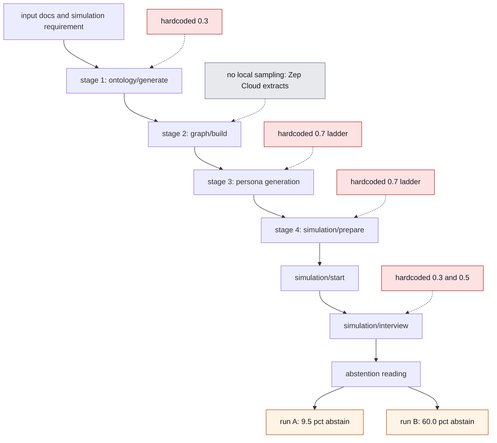
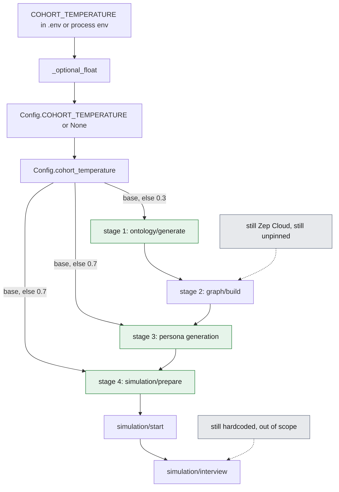
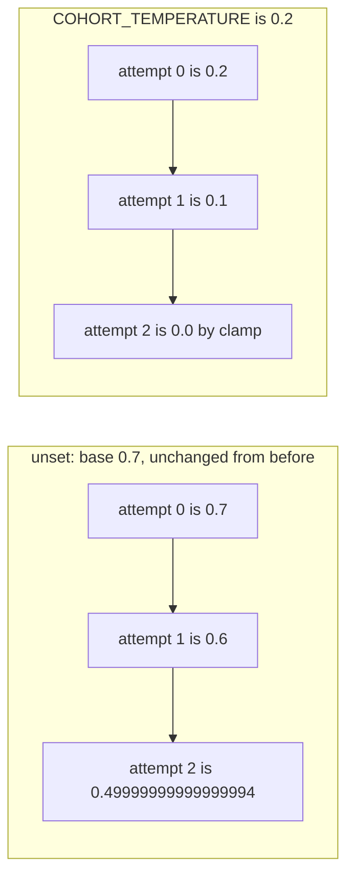

# Issue #751 — Make cohort-construction temperature configurable

## 1. The problem

Re-running MiroFish over the same input builds a *different crowd* every time. The
ontology comes back different, the entities come back different, and the personas
that get turned into agents come back different. For interactive use that is fine,
arguably even desirable. For anything that compares one run against another it means
the result is not reproducible, and nothing in the API surface says so.

The reporter of #751 measured it. Running the same event description repeatedly
through `graph/ontology/generate` → `graph/build` → `simulation/prepare` →
`simulation/start` → `simulation/interview`, with a **byte-identical interview
prompt**, gave **9.5% abstention on one run and 60.0% on another**. Same input, same
prompt, same code — a sixfold difference in the headline reading.

They traced it to three hardcoded sampling temperatures and asked for them to be made
configurable with today's values as defaults: unset keeps current behaviour, `0` gives
a reproducible cohort. They explicitly flagged a trap for whoever implemented it: both
persona-side call sites compute `0.7 - (attempt * 0.1)` to descend on retry, so a
configurable base of `0` would compute *negative* temperatures.

### What this fix does not achieve

The reporter followed up twice, and the second comment is a correction that bounds
this change. It is worth stating up front rather than burying it.

Their original claim was that with the temperatures at 0, "three of four subsequent
runs produced byte-identical persona rosters". That turned out to be a hash of persona
**names** only. Comparing the full `persona` field in `reddit_profiles.json` across
the same four builds:

| pair | `persona` field differs |
| --- | --- |
| 1 vs 2 / 3 / 4 | 19/19 |
| 2 vs 3 | 3/20 |
| 2 vs 4 | 3/20 |
| 3 vs 4 | **0/20** |

Only the 3-vs-4 pair had identical personas. The names were stable; the descriptions
that actually define each agent's viewpoint were not. Worse, the pair with *identical*
personas differed by 0.2481 in the final probability reading while the closest pair
(0.0393) had three personas differing — identical names do not imply identical people,
and identical people did not produce identical readings.

They also measured that with all the cohort temperatures at 0, two consecutive
`ontology/generate` + `graph/build` in the **same container** still produce different
entity sets — 27 vs 26 entities, 24 shared. And separately, that determinisation holds
only within one container lifetime: the first build after a restart often yields a
different roster, including a different persona count. They did not identify the cause
and did not assert one.

Their conclusion, quoted because it is the right framing: *"if the change ships
described as 'reproducible cohorts', that description will not hold in practice."*

So the honest scope of this change is: **it removes the three hardcoded local sampling
points as a source of run-to-run churn, and gives operators one knob to pin them.** It
does not make cohort construction reproducible end to end, because the entity
extraction step between ontology and persona generation does not run locally at all
(see section 2). Treat it as a prerequisite for reproducibility work, not as the whole
of it.

## 2. Root cause

Three separate LLM calls on the cohort-construction chain each carried their own
hardcoded temperature literal, with no way to reach any of them from configuration.
Against `origin/main`:

| stage | site | literal |
| --- | --- | --- |
| ontology generation | `backend/app/services/ontology_generator.py:237` | `temperature=0.3,` |
| persona generation | `backend/app/services/oasis_profile_generator.py:581` | `temperature=0.7 - (attempt * 0.1),` |
| simulation config generation | `backend/app/services/simulation_config_generator.py:452` | `temperature=0.7 - (attempt * 0.1),` |

Two aggravating details:

**The third site is easy to miss.** It lives inside
`SimulationConfigGenerator._call_llm_with_retry` (`simulation_config_generator.py:435`,
loop at `:442`) and is reached via `SimulationManager.prepare_simulation()`. The
reporter missed it on a first pass that only grepped the files already known to be on
the path; a grep for "temperature" across `backend/app/services/` is what surfaces it.

**The retry ladders are descending, deliberately.** Both persona-side sites run
`max_attempts = 3` (`oasis_profile_generator.py:568`,
`simulation_config_generator.py:439`) and lower the temperature by 0.1 per attempt,
annotated `# 每次重试降低温度`, because a cooler sample is more likely to come back as
parseable JSON. Any change that makes the base configurable inherits that arithmetic,
which is where the negative-temperature trap comes from.

**Why pinning these three is not sufficient.** `backend/app/services/graph_builder.py`
contains **no** local LLM call — grep it for `temperature` or `chat.completions` and
you get zero hits. It submits text to Zep Cloud as `BatchAddItem`
(`graph_builder.py:471`) and reads the extracted nodes back
(`graph_builder.py:550`, `:587`). Entity extraction therefore happens server-side,
outside anything this repo can pin, and the entity summaries it returns are fed
straight into the persona prompt
(`oasis_profile_generator.py:559-561` →
`_build_individual_persona_prompt(entity_name, entity_type, entity_summary, ...)`).
Different summaries produce different persona text even at temperature 0. That is the
structural explanation for the reporter's correction in section 1.

## 3. Flow before the fix

Every stage marked in red sampled at a temperature that existed only as a literal in
the source. Three of them are cohort construction; the interview stage has three more
of its own. Nothing on this chain could be influenced from `.env`, so two runs of the
same input diverged at the first stage and kept diverging.



The chain is sequential, so the divergence compounds: a different ontology yields a
different entity set, which yields a different persona population, which yields a
different simulation config, which yields a different reading. By the time the
interview prompt is sent — byte-identical between runs — it is being sent to a
different crowd.

## 4. Flow after the fix

One setting, `COHORT_TEMPERATURE`, is read once in `backend/app/config.py` and resolved
per call through `Config.cohort_temperature(default, attempt)`. The three green stages
now share a single base value. Leave it unset and each stage falls back to the default
it has always used, so nothing changes for existing deployments.



The two grey annotations are the fix's boundary, not an oversight. `graph/build` has no
local temperature to pin, and the interview stage is left alone on purpose: per-agent
response variation there is the behaviour under study, not noise to be removed.

The retry ladder keeps its shape and gains a floor. `cohort_temperature` still
subtracts `0.1 * attempt`, but the result is clamped with `max(0.0, ...)`, so a low or
zero base can never send a negative temperature to the provider.



Two things about the unset ladder are worth being explicit about, because they are
what makes "nothing changes" a verifiable claim rather than a hope:

- The expression form is unchanged, so the third rung is still
  `0.49999999999999994`, not `0.5`. `0.7 - (2 * 0.1)` has never been exactly `0.5` in
  IEEE-754 double arithmetic, and the fix does not quietly round it into one.
- The clamp cannot alter the unset path, because `max_attempts = 3` at both sites means
  `attempt` only ever takes the values 0, 1 and 2. The old expression first goes
  negative at attempt 7, which is unreachable.

Clamping was chosen over special-casing a zero base. A base of 0 is already the most
reliable setting there is nothing left to descend toward, and the clamp also covers
small bases — `0.05` would otherwise reach `-0.05` on the third attempt — and a
negative base.

## 5. What changed

| file | change | rationale |
| --- | --- | --- |
| `backend/app/config.py` | new `_optional_float()` helper, `Config.COHORT_TEMPERATURE`, `Config.COHORT_TEMPERATURE_RETRY_STEP`, `Config.cohort_temperature()` | one place to read the setting and one place to resolve it, so the three call sites cannot drift apart |
| `backend/app/services/ontology_generator.py` | `temperature=0.3` → `Config.cohort_temperature(0.3)`; added `from ..config import Config` | stage 1 of the chain; the only one of the three that did not already import `Config` |
| `backend/app/services/oasis_profile_generator.py` | `temperature=0.7 - (attempt * 0.1)` → `Config.cohort_temperature(0.7, attempt)` | stage 3; retry ladder preserved, now floored |
| `backend/app/services/simulation_config_generator.py` | same substitution | stage 4; the site reached via `prepare_simulation()` that is easy to miss |
| `.env.example` | documents the variable, commented out | discoverability; an unset variable has to stay unset by default |
| `backend/tests/test_cohort_temperature_config.py` | new, 18 tests | asserts on the `temperature` kwarg actually reaching a stubbed client at all three sites |

The resolver is the whole of the logic (`backend/app/config.py:85-107`):

```python
COHORT_TEMPERATURE = _optional_float('COHORT_TEMPERATURE')
COHORT_TEMPERATURE_RETRY_STEP = 0.1

@classmethod
def cohort_temperature(cls, default: float, attempt: int = 0) -> float:
    base = cls.COHORT_TEMPERATURE
    if base is None:
        base = default
    return max(0.0, base - (attempt * cls.COHORT_TEMPERATURE_RETRY_STEP))
```

Unset is represented as `None` — "not configured" — rather than as a default number.
That is what lets the three differing historic values (0.3, 0.7, 0.7) survive
untouched: the default travels with the call site, not with the setting.

`_optional_float` deliberately does not raise (`backend/app/config.py:17-34`). A
mistyped temperature warns and falls back instead of refusing to start the app:

```python
try:
    return float(raw)
except ValueError:
    import warnings
    warnings.warn(
        f"{key}={raw!r} is not a number; falling back to the built-in defaults.",
        RuntimeWarning,
    )
    return None
```

The call sites are one-liners. For example `oasis_profile_generator.py:581`:

```python
temperature=Config.cohort_temperature(0.7, attempt),  # 每次重试降低温度
```

The name is unprefixed to match the existing settings in `config.py` (`LLM_*`,
`ZEP_*`, `OASIS_*`, `REPORT_AGENT_*`). The issue suggested
`MIROFISH_COHORT_TEMPERATURE`, but the repo has no `MIROFISH_`-prefixed variables
today and one new prefixed key would be the odd one out.

## 6. Validation

```
cd backend && PYTHONPATH="$PWD" python -m pytest -q tests/
```

In the sandbox this was run as:

```
cd /workshop/microfish/wt/doc751/backend && \
PYTHONPATH=/workshop/microfish/wt/doc751/backend \
/workshop/microfish/repo/backend/.venv/bin/python -m pytest -q tests/
```

Results:

| tree | result |
| --- | --- |
| `origin/main` | `129 passed` |
| this branch | `147 passed in 6.36s` |

18 new tests, all in `backend/tests/test_cohort_temperature_config.py`. They stub the
LLM client and assert on the `temperature` kwarg actually passed at each of the three
sites, so no network and no provider call is involved.

### Which tests pass before as well as after

Three of the eighteen are regression guards for "nothing changes for existing users",
and they must pass against `origin/main` too. Running the new file against a clean
`origin/main` checkout with only the test file copied in gives **3 passed, 15 failed**:

| test | on `main` | on this branch |
| --- | --- | --- |
| `test_unset_keeps_ontology_temperature` | pass | pass |
| `test_unset_keeps_persona_retry_ladder` | pass | pass |
| `test_unset_keeps_simulation_config_retry_ladder` | pass | pass |
| `test_zero_pins_every_cohort_stage` | fail | pass |
| `test_configured_base_steps_down_and_stops_at_zero` | fail | pass |
| `test_no_retry_rung_is_ever_negative` (5 params: 0.0, 0.05, 0.1, 0.2, -1.0) | fail | pass |
| `test_env_value_reaches_the_cohort_stages` | fail | pass |
| `test_missing_or_blank_env_value_keeps_legacy_defaults` (3 params: unset, `""`, `"   "`) | fail | pass |
| `test_unparsable_env_value_warns_and_keeps_legacy_defaults` (4 params: `abc`, `0.3abc`, `0,3`, `low`) | fail | pass |

The three passing ones assert the ladder against hardcoded literals
(`[0.7, 0.6, 0.49999999999999994]` and `0.3`) rather than by re-evaluating the old
expression, so drift in the default path fails loudly instead of silently agreeing with
itself. Confirmed by deliberately injecting drift into a scratch copy:

| injected drift | result |
| --- | --- |
| ontology default `0.3` → `0.35` | `test_unset_keeps_ontology_temperature` fails |
| wrap the resolver in `round(..., 10)`, making the third rung a clean `0.5` | 9 tests fail |
| ladder base `0.7` → `0.8` at both sites | both ladder tests fail |

### Bit-level check of the default path

`struct.pack('>d', x).hex()` for the old expression `0.7 - (attempt * 0.1)` against the
new `max(0.0, 0.7 - (attempt * 0.1))`, for every attempt the loops can reach:

| attempt | value | old bits | new bits |
| --- | --- | --- | --- |
| 0 | `0.7` | `3fe6666666666666` | `3fe6666666666666` |
| 1 | `0.6` | `3fe3333333333333` | `3fe3333333333333` |
| 2 | `0.49999999999999994` | `3fdfffffffffffff` | `3fdfffffffffffff` |

Identical. The ontology site is identical too: `0.3` → `3fd3333333333333` both ways.
The first divergence is at attempt 7, where the old expression gives
`-1.1102230246251565e-16` and the new one gives `0.0` — unreachable, since both loops
are `max_attempts = 3`.

### Other checks run by hand

- `COHORT_TEMPERATURE` set to unset / `0` / `0.2` / `banana` in the real process
  environment, asserting on the kwarg reaching a stubbed client at all three sites.
- `locales/en.json` and `locales/zh.json` are untouched by the diff; both parse, both
  have 648 keys, and the key sets are identical. No new i18n keys were needed.
- No circular import from the new `from ..config import Config` in
  `ontology_generator.py`: imported `app`, `app.config`, each of the three service
  modules individually, `app.services.ontology_generator` *before* `app`, and
  `create_app()` — all clean. `backend/app/config.py` imports nothing from the package,
  and the other two services already imported `Config`.
- Test isolation from a developer's `.env`: planted a project-root `.env` containing
  `COHORT_TEMPERATURE=0.9`, then `COHORT_TEMPERATURE=banana`, in a throwaway copy of the
  tree. `147 passed` both times, the second run surfacing exactly one `RuntimeWarning`.
  The unset-path tests pin `Config.COHORT_TEMPERATURE` directly, and the reload tests
  stub `dotenv.load_dotenv` and load `config.py` under a separate module name, so
  `sys.modules['app.config']` is never replaced.

## 7. Pull request description

Submitted upstream as PR #858 against `666ghj/MiroFish`. Reproduced verbatim:

```markdown
## Summary

- Add a single `COHORT_TEMPERATURE` setting covering all three cohort-construction sampling points: ontology generation, persona generation, and simulation-config generation.
- Leave it unset and nothing changes: each stage keeps its own current default (0.3 / 0.7 / 0.7), including the exact floating point values of the retry ladders.
- Set it to `0` and cohort construction is pinned, so the same input reproduces the same crowd.
- Both retry ladders still step down 0.1 per attempt, but the result is clamped at 0, so a low or zero base can never send a negative temperature to the provider.
- Document the variable in `.env.example`.

## Why

Cohort construction is currently non-deterministic: the temperatures are hardcoded at three separate call sites, so every run over the same input builds a different crowd and nothing in the API surface hints at it. #751 reports a variance study where the same input, run twice through `graph/ontology/generate` → `graph/build` → `simulation/prepare` → `simulation/start` → `simulation/interview` with a byte-identical interview prompt, produced 9.5% vs 60.0% abstention. That makes before/after comparisons and bug reports hard to trust.

The third site is inside `SimulationConfigGenerator._call_llm_with_retry`, reached via `SimulationManager.prepare_simulation()`, and is easy to miss when grepping for temperatures.

On the ladder: the two retry sites compute `0.7 - (attempt * 0.1)` to descend toward more reliable JSON on retry. Making the base configurable while keeping that ladder means a base of 0 would compute negative temperatures. I kept the ladder and clamped it at 0 rather than special-casing the zero base, because 0 is already the most reliable setting there is nothing left to descend toward, and clamping also covers small bases (0.05 would otherwise reach -0.05 on the third attempt) and a negative base. The expression form is unchanged, so the unset path is bit-identical — including the fact that the third rung has always been `0.49999999999999994` rather than `0.5`.

A single knob rather than one per stage: the three stages form one chain, and a cohort is only reproducible if all three are pinned, so pinning should not require three variables. Unset is represented as "not configured" rather than as a default number, which is what lets the three differing current values survive untouched. Per-stage overrides can be added later on top of this without a breaking change.

The name is unprefixed to match the existing settings in `config.py` (`LLM_*`, `ZEP_*`, `OASIS_*`, `REPORT_AGENT_*`); the issue suggested `MIROFISH_COHORT_TEMPERATURE`, but the repo has no `MIROFISH_`-prefixed variables today and one new prefixed key would be the odd one out. Happy to rename if you'd rather have the prefix.

The interview stage is deliberately left alone. Per-agent response variation there is the interesting part; only cohort construction needs pinning. Report temperatures are untouched for the same reason.

## Validation

- New `backend/tests/test_cohort_temperature_config.py` (18 tests). It stubs the LLM client and asserts on the `temperature` kwarg actually passed at each of the three sites; no network or LLM calls. Coverage: the unset path at all three sites including every rung of both ladders; a configured base of `0` giving `0` on every rung; `0.2` giving `[0.2, 0.1, 0.0]`; no rung ever negative for bases `0 / 0.05 / 0.1 / 0.2 / -1.0`; and blank or unparsable values falling back to the current defaults with a warning instead of raising at import.
- The three unset-path tests pass against `main` as well as against this branch, which is the regression guard for "nothing changes for existing users". The 15 configurability tests fail on `main` and pass here.
- The ladder's default values are asserted against hardcoded literals rather than by re-evaluating the old expression, so drift in the default path fails loudly instead of silently agreeing with itself.
- Full backend suite: `147 passed` (129 before this change, plus the 18 new ones).
- Also checked by hand with `COHORT_TEMPERATURE` unset / `0` / `0.2` / `banana` set in the real process environment, asserting on the kwarg reaching the stubbed client at all three sites.

One thing I noticed while in `config.py` but deliberately did not touch: `REPORT_AGENT_TEMPERATURE` has no reader anywhere in the repo (`report_agent.py` hardcodes its temperatures), and `REPORT_AGENT_MAX_TOOL_CALLS`, `REPORT_AGENT_MAX_REFLECTION_ROUNDS` and `OASIS_DEFAULT_MAX_ROUNDS` look the same. That's #779's territory and already has a PR open, so I left all four alone.

Fixes #751
```

## 8. Known gaps / review notes

A review pass over this branch turned up the following. None of them break the unset
path, and none are fixed here — they are recorded so the next person does not have to
rediscover them.

### 8.1 The shipped wording promises more than the fix delivers

`.env.example:13` and `backend/app/config.py:84` both say *"设为 0 可得到可复现的人群"* —
set it to 0 to get a reproducible cohort. The PR summary says the same in English:
"Set it to `0` and cohort construction is pinned, so the same input reproduces the same
crowd."

The reporter of #751 measured that this is not true and asked, in the issue being
fixed, for it not to be worded that way: with all the cohort temperatures at 0, two
consecutive `ontology/generate` + `graph/build` in the same container still produced
27 vs 26 entities, and only one of the compared run-pairs had identical `persona`
fields. The structural reason is in section 2 — `graph_builder.py` has no local LLM
call at all, so extraction happens inside Zep Cloud where this setting has no reach.

Suggested wording: the setting pins the three *local* sampling points on the cohort
chain; entity extraction runs in Zep Cloud and remains non-deterministic. That is
accurate and still worth having.

### 8.2 The setting is silently ignored for GPT-5-family models

`backend/app/utils/openai_chat_compat.py:48-49`:

```python
if temperature is not None and not gpt5_family:
    kwargs["temperature"] = temperature
```

All three new call sites funnel through `create_chat_completion` — the persona and
simulation-config sites directly, the ontology site via
`LLMClient._create_completion` (`backend/app/utils/llm_client.py:122-130`). When
`LLM_MODEL_NAME` starts with `gpt-5` (`openai_chat_compat.py:13-17`) the kwarg is
dropped entirely.

Verified with a stubbed client and `COHORT_TEMPERATURE=0`:

| `LLM_MODEL_NAME` | `temperature` kwarg sent on the 3 rungs | values |
| --- | --- | --- |
| `qwen-plus` | yes, yes, yes | `[0.0, 0.0, 0.0]` |
| `gpt-5` | no, no, no | kwarg absent |
| `gpt-5-mini-2025-08-07` | no, no, no | kwarg absent |

Failing scenario: an operator on `gpt-5-mini` sets `COHORT_TEMPERATURE=0`, gets exactly
the old non-deterministic behaviour, and receives no warning. Dropping the kwarg is
correct at the transport layer — the GPT-5 API rejects `temperature` — so the gap is in
the config surface, which should either say so or warn from `Config.validate()`.

### 8.3 `_optional_float` accepts `inf`, and the clamp is lower-bound only

`backend/app/config.py:17-34` guards against `ValueError` only, and `float()` does not
raise for several values that are not usable temperatures. `max(0.0, ...)` at
`config.py:107` clamps the bottom but not the top. Measured, with the resulting ladder:

| raw value | `Config.COHORT_TEMPERATURE` | ladder sent to the provider | warned |
| --- | --- | --- | --- |
| `inf`, `+inf`, `Infinity`, `1e400` | `inf` | `[inf, inf, inf]` | no |
| `nan`, `NaN` | `nan` | `[0.0, 0.0, 0.0]` | no |
| `-inf`, `-1` | `-inf`, `-1.0` | `[0.0, 0.0, 0.0]` | no |
| `7` (plausible typo for `0.7`) | `7.0` | `[7.0, 6.9, 6.8]` | no |
| `1_0` | `10.0` | `[10.0, 9.9, 9.8]` | no |
| `  0.5  ` | `0.5` | `[0.5, 0.4, 0.3]` | no — correct, whitespace is tolerated |
| `abc`, `0x1p-1` | `None` | falls back to defaults | yes |

With `inf`, httpx 0.28.1 refuses to serialise the request body before anything is sent:
`ValueError: Out of range float values are not JSON compliant: inf`. What happens next
differs by site:

- `oasis_profile_generator.py:571-625` catches bare `Exception` at `:616`, logs a
  warning truncated to 80 characters, retries three times, then **falls through to
  `_generate_profile_rule_based` at `:623`**. Reproduced end to end: with
  `COHORT_TEMPERATURE=inf` the persona site returns a rule-based stub with
  `bio: "Expert and thought leader in their field."` and the caller sees success. Every
  agent in the cohort silently becomes a generic placeholder.
- `simulation_config_generator.py:442-483` re-raises after three attempts — fails
  loudly, which is fine.
- `ontology_generator.py:238` → `chat_json` re-raises
  (`llm_client.py:197-208`) — also fails loudly.

The same silent persona fallback is reached by any out-of-range value a provider
rejects with a 400, including `7`. A range check in the caller — warn and fall back
unless `0 <= value <= 2` — would close it. Note also the inconsistency: `banana` warns,
but `nan`, `-1` and `7` do not. `-1.0` being accepted is intentional and asserted by
`test_no_retry_rung_is_ever_negative[-1.0]`, but it is still normalised to 0 with no
word to the operator.

### 8.4 A mistyped value warns before the app logger exists

`backend/app/config.py:28-33` reports a bad value through `warnings.warn`. The warning
fires at import time: `backend/app/__init__.py:15` imports `.config` at module level,
while `setup_logger('mirofish')` only runs inside `create_app`
(`backend/app/__init__.py:30`). So the message goes to stderr through the warnings
machinery, not into the application log. In a container that only ships the app log, a
typo quietly reverts to the historic defaults with no visible signal.

This is also inconsistent with the rest of `config.py`, where a malformed value crashes
at import — `OASIS_DEFAULT_MAX_ROUNDS` and `REPORT_AGENT_TEMPERATURE` use bare `int()`
and `float()`. The "do not crash the app over one typo" choice is defensible and is
documented in the helper's docstring; the issue is that the signal is weak.

### 8.5 Two sources of truth for the value

`backend/app/__init__.py:22` does `app.config.from_object(config_class)`, which copies
`COHORT_TEMPERATURE` into `app.config`, but all three call sites read the `Config`
class directly. Verified:

- `create_app(TestConfig)` where `TestConfig(Config)` sets `COHORT_TEMPERATURE = 0.0`
  leaves `app.config['COHORT_TEMPERATURE'] == 0.0` while
  `Config.cohort_temperature(0.7, 0)` still returns `0.7`.
- `app.config['COHORT_TEMPERATURE'] = 0.0` has no effect on the call sites either.
- A runtime `Config.COHORT_TEMPERATURE = 0.0` *is* respected, because
  `cohort_temperature` reads `cls.COHORT_TEMPERATURE`. The tests rely on this.

Latent only: nothing in the repo passes a `config_class` to `create_app`, and nothing
in `backend/` reads `current_app.config`, so this matches the existing convention.
Flagged so nobody later tries to "configure" it through `app.config` and is surprised.

### 8.6 The issue's headline metric is still not reproducible

The evidence in #751 is an interview abstention rate, measured through
`simulation/interview`. That path has three further hardcoded temperatures this change
does not touch:

| site | value | function |
| --- | --- | --- |
| `backend/app/services/zep_tools.py:1609` | `0.3` | `_select_agents_for_interview` — chooses *which* agents are interviewed |
| `backend/app/services/zep_tools.py:1668` | `0.5` | `_generate_interview_questions` |
| `backend/app/services/zep_tools.py:1726` | `0.3` | `_generate_interview_summary` |

Leaving the interview alone is the right scope call for *agent responses*, but agent
selection and question generation are measurement apparatus rather than the thing being
measured. The 9.5%-vs-60.0% number therefore stays unreproducible even with
`COHORT_TEMPERATURE=0`. Not a bug in this patch; worth stating so the PR is not read as
closing the measurement gap.

### What was checked and found correct

- The unset path is bit-identical for every reachable attempt (section 6), including
  the `0.49999999999999994` third rung and the ontology site's `0.3`. `attempt` comes
  from `range(3)` at both sites, so it can never be negative or non-integer. (If a
  negative attempt were ever passed it would *raise* the temperature, since there is no
  upper clamp — not reachable today.)
- No circular import under any entry point; the scripts under `backend/scripts/` are
  unaffected, since the three simulation runners do not touch cohort construction.
- The new tests are load-bearing, not self-confirming: three drift injections each
  produced the expected failures.
- Test isolation holds against a developer's `.env`, and there is no `conftest.py` or
  `filterwarnings = error` in `backend/pyproject.toml` that the import-time warning
  could poison.
- `locales/en.json` and `locales/zh.json` are byte-unchanged, both valid JSON, 648 keys
  each, key sets identical.
- The `.env.example` insertion point is safe: the new block sits above the
  `LLM_BOOST_*` section whose comment warns those keys must not appear unless used, so
  *"下面的配置项"* still refers to the boost keys.
- `README.md` documents only *required* environment variables, so omitting
  `COHORT_TEMPERATURE` there is consistent.
- The PR's side observation checks out: `REPORT_AGENT_TEMPERATURE` occurs exactly once
  in the repo, at its own definition (`backend/app/config.py:81`), with no reader.
