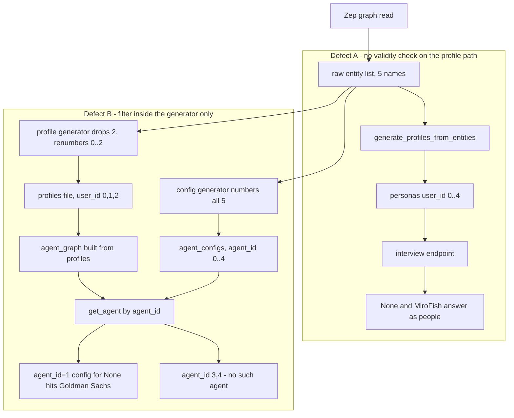
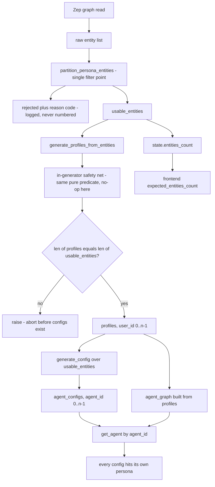

# Issue #759 — Non-entity names are promoted to simulated personas

## 1. The problem

Issue #759 reports two distinct things. This document covers the second one.

The reporter built the same input twice in the same container with every cohort
temperature pinned to 0, then dumped the `Entity` nodes per `graph_id`. Build 1
returned 27 entities, build 2 returned 26, with 24 shared. Every single
difference was in a **non-person** entity — the 18 real person names were
identical across both builds. The names that differed were things like `Person`,
`bear case`, `Client`, `HedgeFundManager`, and
`breaking headlines, sourced color, thread summaries of what each side believes`.

Looking at the full extraction for one input, the "entities" included:

* `edges`
* `None`
* `market event`
* `Posts 3-5 times daily: cross-asset takes, historical analogies ('I've seen this movie before'), decay-of-panic arguments.`
* `supply chain detail, management call parsing, unit economics`
* `MiroFish` — the product's own name, lifted out of the input text

None of those are participants. A graph-API artifact, a Python `None` that got
stringified somewhere upstream, a two-word descriptive phrase, a verbatim
sentence from the source document, a comma-separated list of research topics,
and the name of the tool running the simulation.

All of them became agents. In the reporter's words: *"In one of our runs the
persona roster of 20 contained `market event` and `MiroFish` as two of the
twenty 'people'. They were interviewed and they answered."* So 10% of that
cohort was noise that nonetheless produced interview answers which then fed
into the aggregate reading.

What makes this a code defect rather than a prompt-quality complaint is that the
constraint was already written down. The project's own `simulation_requirement`
says:

> *Agent personas MUST be individual people (Person entities), NOT companies;
> companies mentioned in the event are discussion topics, not participants.*

The rule existed in the prompt that drives cohort construction. It was advisory
and the model ignored it, and nothing in the code checked.

**Not addressed here.** The first half of #759 — that extraction is
nondeterministic even at temperature 0, so the same input yields different
entity sets across reruns — is **not** fixed by this patch. Reruns will still
produce different entity sets, different persona counts, and different persona
text under identical names. That belongs to the extraction / graph-build layer.
This patch only stops the junk that *is* extracted from becoming interviewable
agents. The reporter's L2 spread across runs (`0.0393` to `0.5877`) will shrink
by whatever the junk personas were contributing and no further.

## 2. Root cause

`generate_profiles_from_entities` (`backend/app/services/oasis_profile_generator.py:895`
on `origin/main`) iterated the entity list and called
`generate_profile_from_entity` for every element with no validity check on that
path at all. There is no filter before it either: `prepare_simulation` read the
graph and handed `filtered.entities` straight through
(`backend/app/services/simulation_manager.py:358` on `origin/main`).

Two helpers *look* like they should have been doing this job and were not.
`_is_individual_entity` and `_is_group_entity`
(`oasis_profile_generator.py:532` and `:536` on `origin/main`) are consulted at
`:556`–`:563` purely to decide **which prompt template to send** — individual
persona prompt versus `_build_group_persona_prompt` (`:770`). An entity type
matching neither list still got a persona, just via the group branch. Nothing
anywhere returned "skip this one".

### Why the filter cannot live inside the profile generator

This is the part that decides the shape of the fix.

Persona identity in this system is **positional**, not keyed. Two independent
numberings are derived from the same entity list and then joined by integer:

* `generate_profiles_from_entities` assigns `user_id=idx` where `idx` is the
  index into the list it was given
  (`backend/app/services/oasis_profile_generator.py:1140`), and those `user_id`s
  are what get written to `reddit_profiles.json` / `twitter_profiles.csv`.
* `_generate_agent_configs_batch` assigns
  `agent_id = start_idx + i` over the list *it* was given
  (`backend/app/services/simulation_config_generator.py:829` and `:884`).

At runtime the two are fused. The agent graph is built **from the profiles
file** — `generate_reddit_agent_graph(profile_path=...)` at
`backend/scripts/run_parallel_simulation.py:1329` (Twitter: `:1138`) — and then
agents are looked up **by the config's integer**:
`result.env.agent_graph.get_agent(agent_id)` at
`backend/scripts/run_parallel_simulation.py:1186`, where `agent_id` came from
`post.get("poster_agent_id")` at `:1183`. The same integer join is used for
interviews (`run_parallel_simulation.py:330`, `:460`, `:487`) and for the
`agent_id -> entity_name` map that labels `actions.jsonl`
(`run_parallel_simulation.py:633`–`654`).

So the list is fanned out to two consumers that each number it independently,
and the numbers are assumed to agree. Filtering inside
`generate_profiles_from_entities` shrinks exactly one side of that fan-out.
`prepare_simulation` calls the profile generator at `simulation_manager.py:382`
and the config generator at `:464`; a filter inside the former and not the
latter renumbers the profiles while the configs keep counting over the unfiltered
list. Every id past the first rejected entity is then off by the number of
rejects, silently, with no error anywhere. Reproduced below in §6.

That is why the fix reaches into `simulation_manager` and filters **once, before
the fan-out**, rather than being a three-line guard in the generator loop.

## 3. Flow before the fix



The worked example throughout this document is the five-entity list
`Elon Musk`, `None`, `Goldman Sachs`, `MiroFish`, `Tsinghua University`, which
is the one §6 actually runs.

**Defect A** is what the reporter saw. The raw list goes to the profile
generator untouched, so `None` and `MiroFish` get `user_id`s, land in
`reddit_profiles.json`, become nodes in the agent graph, and answer interviews.
Of the six junk names in the report, the shipped filter rejects five; the one it
does not, `market event`, is covered in §8.1 — the "before" state here is not
fully repaired, and deliberately so.

**Defect B** is the trap in the obvious one-line fix, and it is why the diff is
bigger than it looks like it should be. If you only guard the generator loop,
the profile list shrinks to `Elon Musk, Goldman Sachs, Tsinghua University`
numbered `0,1,2`, while the activity configs are still numbered `0..4` over the
unfiltered list. Config `agent_id=1` was generated for `None` but is applied to
`Goldman Sachs`; config `agent_id=2` was generated for `Goldman Sachs` but is
applied to `Tsinghua University`; configs `3` and `4` — including
`Tsinghua University`'s own, the last real entity — address agents that do not
exist. `poster_agent_id` on the initial posts is assigned out of the same config
list, so initial posts are attributed the same way. Nothing raises; the
simulation just runs with the wrong activity profile bound to each persona.

## 4. Flow after the fix



`prepare_simulation` calls `partition_persona_entities` immediately after
reading the graph (`simulation_manager.py:311`) and from then on there is only
one list. `usable_entities` goes to the profile generator (`:382`), to the
config generator (`:464`), and to `state.entities_count` (`:321`), so the two
numberings are derived from the same sequence and cannot drift. Rejected
entities never enter the numbered list — they are logged with a reason code
(`:312`–`:317`) and counted in the progress message.

The generator keeps its own call to `partition_persona_entities`
(`oasis_profile_generator.py:1085`) as a safety net for
`POST /api/simulation/generate-profiles`
(`backend/app/api/simulation.py:1473`), which is a profiles-only endpoint with
no config fan-out. Because the predicate is pure and the partition is
idempotent, running it a second time on an already filtered list returns the
same list and renumbers nothing.

That argument is sound but it is an argument, and it rests on two call sites
happening to invoke the same function. The `CHK` node above is what makes it a
**check**: `simulation_manager.py:396` compares `len(profiles)` against the
entity count it handed in and raises if they differ. It sits between profile
generation and config generation, so a generator that ever returns a short list
aborts the run with an explicit error instead of silently misbinding every
config past the first drop. In normal operation it never fires.

## 5. What changed

| File | Why |
| --- | --- |
| `backend/app/services/oasis_profile_generator.py` | `_persona_entity_reject_reason(name)` predicate, `_has_list_conjunction(segment)` helper, and `partition_persona_entities(entities)` splitter, plus the in-generator safety-net call and the skip logging / progress notice. The predicate lives here because this is the module that owns "what a persona is". |
| `backend/app/services/simulation_manager.py` | The actual fix: filter once at `prepare_simulation:311`, right after the graph read, and pass the surviving list to **both** the profile generator and the config generator. Also the `len()` invariant backstop at `:396`, the post-filter `entities_count` at `:321`, and the distinct all-rejected error at `:332`–`:344`. |
| `backend/app/api/simulation.py` | The synchronous entity-count preview on `POST /<id>/prepare` applies the same filter, so the `expected_entities_count` the frontend shows as the target is a number the run can actually reach. |
| `backend/tests/test_persona_entity_filter.py` | 123 cases. Beyond the junk and invariant coverage, the must-be-accepted fixtures carry every legitimate name an earlier revision of the predicate wrongly rejected, and `KNOWN_UNCAUGHT_JUNK` asserts the junk that is knowingly *not* caught, so the coverage boundary is pinned in both directions. |
| `locales/en.json`, `locales/zh.json` | Three `progress.*` keys: the per-entity skip log, the aggregate progress notice, and the all-rejected error. |

### The predicate

`backend/app/services/oasis_profile_generator.py:118`–`:195`. The governing
constraint is **reject only what is unambiguously not a name**. A dropped entity
silently removes a real participant from the cohort, which is a worse failure
than letting a junk entity through: the junk is visible in the roster, the
missing participant is not.

Rules are evaluated in order; the first match wins and returns a reason code.
Rule 0 is the normalization step the rest operate on.

| # | Reason code | Condition | Threshold / justification |
| --- | --- | --- | --- |
| 0 | — | `strip()`; reject on interior newline; then collapse every `\s+` run to a single ASCII space (`:146`–`:156`) | The newline test runs *before* collapsing, so `"Elon Musk\n"` is a name with trailing whitespace rather than a fragment, while `"First line\nsecond line"` is still caught. Collapsing non-breaking space, tab and ideographic space means an unusual separator cannot bypass a later rule — previously `market\xa0event` and `supply chain detail,\tmanagement call parsing,\tunit economics` both slipped past. |
| 1 | `empty_name` | not a `str`, or empty after `strip()` (`:143`–`:148`) | An entity with no name cannot be addressed by the interview API at all. |
| 2 | `prose_fragment` | interior `\n` or `\r` (`:153`) | A name does not span lines. |
| 3 | `placeholder` | whole normalized name, case-folded, in `{none, null, n/a, undefined, unknown, entity, node, nodes, edge, edges, 无, 未知, 节点, 边, 实体, 空, なし, 不明}` (`:83`, `:160`) | A **vocabulary** list, not a structural test. Whole-name exact match only — no prefix or substring matching — so `Nonesuch Capital`, `Edgewater Partners`, `Node Labs` and `无锡市政府` are unaffected, and there is a test asserting exactly that. The CJK half matters because `zh` is the default locale and extraction emits the same artifacts in Chinese; without it the filter was close to inert for the project's primary language. |
| 4 | `self_reference` | whole name in `{mirofish}` (`:96`, `:162`) | Also vocabulary rather than structure. The product is the tool running the simulation, categorically never a participant. Whole-name match, so a real company whose name merely starts with it is unaffected. |
| 5 | `prose_fragment` | contains `': '` or `'：'` (`:169`); **or** last character in `。；;` (`:174`); **or** longer than 160 characters (`:103`, `:177`) | `label: content` is the precise signature of the reporter's 121-character fragment, and a colon does not appear in a name — this is a sharper signal than any character count. `': '` rather than a bare colon so `3:1` and `12:30` are safe. `。`/`；`/`;` never appear in a name either, and `。` is the main terminator in Chinese prose. `!` and `?` are deliberately **absent**: `Yahoo!`, `Wham!` and `Guess Who?` are real names. The 160-character cap is a backstop only, to stop a whole paragraph reaching the persona prompt; the longest real name in the test corpus is 99 characters, so the margin is deliberately wide. |
| 6 | `clause_list` | 3+ segments split on `,` **or** `、`, **and** the final segment contains no conjunction, **and** (for `,` only) at least two segments are multi-word (`:108`–`:113`, `:185`–`:193`, helper at `:198`) | Catches `supply chain detail, management call parsing, unit economics`. The conjunction exemption (`and`/`&` as whole tokens, `和`/`与`/`及`/`暨` as substrings) is what lets `Bureau of Alcohol, Tobacco, Firearms and Explosives` through: real multi-comma organisation names almost always end in a conjunction, enumerations do not. Whole-token matching for `and` so `Rand`, `Anderson` and `brands` do not count. The multi-word requirement spares `Smith, John, Jr.` and `Skadden, Arps, Slate, Meagher & Flom`, whose segments are single surnames. `、` is included because Chinese lists use it and no real organisation name contains two; the multi-word requirement is skipped there because Chinese does not word-separate with spaces. |

Entity *type* is never consulted. Organizations and institutions are valid
personas by design — `_build_group_persona_prompt` exists specifically for them
— so only the shape of the *name* is inspected.

### What was dropped, and why

This is the part worth a reviewer's attention. Three rules in the first revision
of this filter were removed because each of them rejected real participants,
which is the failure mode the whole change exists to prevent.

| Dropped rule | What it caught | Why it had to go |
| --- | --- | --- |
| `descriptor_phrase`: all-lowercase **and** contains a space | `market event`, `bear case` | It rejected **any** lowercase multi-word name. Confirmed false positives: `elon musk`, `john smith`, `goldman sachs`, `zhang wei`, `kim jong un`, `mohammed bin salman`, `nguyen van an`, `van der berg`, `de la cruz`, `ing bank`, `lululemon athletica`, `3m company`, `ing groep n.v.`, and `bell hooks`, `k.d. lang`, `danah boyd`, `e e cummings`, who spell their names that way. Any all-lowercase source document — a chat transcript, a scraped forum thread, subtitles — would have had its **entire multi-word roster** dropped and the run would have failed with a message blaming the graph. Its protection was also illusory: it only matched the lowercase spelling, so `Market Event` always slipped through. It bought a false sense of coverage for one spelling of one phrase. |
| trailing period: ends with `.` **and** 5+ words | nothing in the report that the colon test does not already catch | "Ends with a period and has five or more words" *is* the standard legal form of a registered company name. It rejected `The Goldman Sachs Group, Inc.` (5 words), `Taiwan Semiconductor Manufacturing Company Ltd.`, `John Wiley & Sons, Inc.`, `United Parcel Service of America, Inc.`, `Bank of New York Mellon Corp.`, `The Procter & Gamble Distributing Co.`, `Hong Kong and Shanghai Banking Corp.`, `Industrial and Commercial Bank of China Ltd.` (7), `E. I. du Pont de Nemours and Co.` (8), `Her Majesty's Revenue and Customs Dept.`, and the person name `Rev. Dr. Martin Luther King Jr.`. The alternative — exempting a list of legal and honorific suffixes — was rejected as a maintenance trap: the list is unbounded across jurisdictions (`s.r.o.`, `K.K.`, `B.V.`, `Oy`, `Ltda.`, `Dept.`, …) and would be permanently incomplete, while the rule's only confirmed catch was redundant. Cost of dropping it: short prose sentences such as `The deal closed.` now pass. |
| `!` `?` `！` `？` as sentence terminators | nothing in the report | Rejected `Yahoo!`, `Wham!` and `Guess Who?`. `Yahoo!` in particular is a plausible `MediaOutlet` entity. `。`, `；` and `;` were kept, since those genuinely never appear in a name. |

The 80-character cap was also widened to 160. At 80 it rejected
`Massachusetts Institute of Technology Computer Science and Artificial
Intelligence Laboratory` (93) and `Chinese Academy of Sciences Institute of
Automation Research Center for Brain-Inspired Intelligence` (99), and
`National Institute of Standards and Technology Information Technology
Laboratory` sat exactly on the 80-character limit, with no margin at all. A character count is also
script-relative in a way that makes it a poor rule: the CAS institute above is
19 characters written as `中国科学院自动化研究所类脑智能研究中心`, so an
80-character cap accepts or rejects the same institution depending on which
language the document was written in. Prose detection now rests on the newline
and colon tests, which are script-independent.

```python
def _persona_entity_reject_reason(name: Any) -> Optional[str]:
    if not isinstance(name, str):
        return "empty_name"
    stripped = name.strip()
    if not stripped:
        return "empty_name"
    if '\n' in stripped or '\r' in stripped:
        return "prose_fragment"
    normalized = _WHITESPACE_RUN_RE.sub(' ', stripped)
    lowered = normalized.lower()
    if lowered in _NON_ENTITY_NAME_PLACEHOLDERS:
        return "placeholder"
    if lowered in _SELF_REFERENCE_NAMES:
        return "self_reference"
    if ': ' in normalized or '：' in normalized:
        return "prose_fragment"
    if normalized[-1] in '。；;':
        return "prose_fragment"
    if len(normalized) > _MAX_ENTITY_NAME_CHARS:
        return "prose_fragment"
    for separator in _CLAUSE_SEPARATORS:
        segments = [segment.strip() for segment in normalized.split(separator)]
        if len(segments) < 3:
            continue
        if _has_list_conjunction(segments[-1]):
            continue
        if separator == ',' and sum(1 for s in segments if ' ' in s) < 2:
            continue
        return "clause_list"
    return None
```

### The single filter point

`backend/app/services/simulation_manager.py:309`–`:344`:

```python
# 只过滤一次：人设和Agent活动配置必须拿到同一份实体列表，
# 否则 profile 的 user_id 与 agent_config 的 agent_id 会错位
usable_entities, skipped_entities = partition_persona_entities(filtered.entities)
for skipped_entity, reason in skipped_entities:
    logger.warning(t('progress.personaEntitySkipped',
                     name=skipped_entity.name, reason=reason))

state.entities_count = len(usable_entities)
...
if not usable_entities:
    state.status = SimulationStatus.FAILED
    if skipped_entities:
        state.error = t('progress.allPersonaEntitiesSkipped',
                        count=len(skipped_entities))
    else:
        state.error = "没有找到符合条件的实体，请检查图谱是否正确构建"
    self._save_simulation_state(state)
    raise ValueError(state.error)
```

`usable_entities` is then the only list passed onward, at `:382` (profiles) and
`:464` (configs). `partition_persona_entities` returns new lists and never
mutates its argument or its elements, which is what makes the duplicate call in
the generator safe.

The two-branch error is a correctness fix in its own right. The original
message — "no matching entities found, please check that the graph was built
correctly" — is right when the reader returned nothing, but once a persona
filter exists it also fires when the graph built perfectly well and the filter
rejected every entity. That diagnosis points the operator at the wrong layer, so
the all-rejected case now gets its own `t()` message naming the filter and
pointing at the per-entity reasons already in the log.

### The invariant backstop

`backend/app/services/simulation_manager.py:391`–`:400`:

```python
if len(profiles) != total_entities:
    raise ValueError(
        f"人设数量与实体数量不一致: profiles={len(profiles)}, "
        f"entities={total_entities}；user_id 与 agent_id 会错位，已中止"
    )
```

Placed between profile generation and config generation, before
`save_profiles`. It turns the positional invariant from something maintained by
convention into something checked: if the generator ever returns a shorter list
than it was given — a stricter in-generator filter, a dropped slot — the run
stops with an explicit error rather than binding every config past the first
drop to the wrong persona.

## 6. Validation

```
cd backend && PYTHONPATH=$PWD python -m pytest -q tests/
```

```
252 passed in 3.81s
```

129 before this change, 123 added (`pytest --collect-only
tests/test_persona_entity_filter.py` reports `123 tests collected`).
`python -m compileall` is clean on `backend/app` and `backend/tests`, and
`git diff origin/main --check` is clean.

### The reporter's six junk names

| name from the report | first revision | shipped |
| --- | --- | --- |
| `None` | `placeholder` | `placeholder` |
| `edges` | `placeholder` | `placeholder` |
| `Posts 3-5 times daily: cross-asset takes, …, decay-of-panic arguments.` | `prose_fragment` (length) | `prose_fragment` (colon) |
| `supply chain detail, management call parsing, unit economics` | `clause_list` | `clause_list` |
| `MiroFish` | `self_reference` | `self_reference` |
| `market event` | `descriptor_phrase` | **accepted — see §8.1** |

Five of six. Coverage *gained* relative to the first revision: `无`, `未知`,
`节点`, `边`, `实体`, `空`, `なし`, `不明`,
`供应链细节、管理层电话会议解析、单位经济效益`, `他说这笔交易将会完成。`,
`Summary: a two-sided market event`, `简介：对冲基金经理`, and clause lists
separated by non-breaking spaces or tabs. Coverage *lost*: `market event` and
`bear case`.

### Corpus

An offline corpus run over the predicate: **158 legitimate names, zero
rejected**. It covers Western person names including particles, hyphens,
apostrophes and embedded commas; CJK, Arabic, Cyrillic, Devanagari, Greek,
Hebrew and Thai person names; institutions in Latin and CJK script; law-firm
names with four or more comma segments; the five-to-eight-word legal entity
names; the 93- and 99-character institution names; lowercase-styled brands and
lowercase-spelled personal names; names ending in `!` or `?`; and whitespace
variants of a name that is otherwise fine. **33 junk inputs, all rejected.**

Every name in that corpus that an earlier revision rejected is now in the
must-be-accepted test fixtures (`PERSON_NAMES` at
`backend/tests/test_persona_entity_filter.py:48`, `GROUP_NAMES` at `:83`), so
the regression cannot come back silently.

### Before-fix evidence, defect A

Feeding the worked example — `Elon Musk`, `None`, `Goldman Sachs`, `MiroFish`,
`Tsinghua University` — through `generate_profiles_from_entities` with the
filter stubbed out produces a roster of five with `user_id` `0..4`, every one of
them a graph node that `get_agent` will return and that the interview endpoint
will answer for. With the filter, the roster is
`['Elon Musk', 'Goldman Sachs', 'Tsinghua University']` with `user_id` `0..2`,
no gaps, and `reddit_profiles.json` matches
(`test_invalid_entities_are_dropped_without_leaving_holes`).

### Before-fix evidence, defect B

Running the real `generate_profiles_from_entities` against the real
`_generate_agent_configs_batch` (LLM stubbed to fail so the rule-based path is
used, `AGENTS_PER_BATCH=2` to exercise batch offsets) over the same five names,
with the filter applied on the profile side only:

```
agent_id=0 config_for='Elon Musk'           -> applied_to='Elon Musk'
agent_id=1 config_for='None'                -> applied_to='Goldman Sachs'          <-- MISBOUND
agent_id=2 config_for='Goldman Sachs'       -> applied_to='Tsinghua University'     <-- MISBOUND
agent_id=3 config_for='MiroFish'            -> applied_to='<<NO SUCH AGENT>>'       <-- MISBOUND
agent_id=4 config_for='Tsinghua University' -> applied_to='<<NO SUCH AGENT>>'       <-- MISBOUND
```

With `prepare_simulation`'s single upstream filter the same harness reports zero
misbindings, including across batch boundaries. The partition was also checked
to be pure (input list and its elements unmutated, element identity preserved in
the output) and idempotent (second pass returns the same list, zero additional
rejects).

### Invariant coverage

Two tests, because one is not enough:

* `test_prepare_simulation_uses_one_entity_list_for_profiles_and_configs`
  (`:395`) stubs the collaborators and asserts that profile generation and
  config generation receive the same list — `==` for contents and length,
  plus element-wise `is` for identity.
* `test_prepare_simulation_binds_real_profiles_to_real_agent_configs` (`:457`)
  is the one that matters. It drives the **real** `OasisProfileGenerator`
  (constructed offline: `Config.LLM_API_KEY` stubbed, `OpenAI` replaced,
  `create_chat_completion` set to raise) and the **real**
  `_generate_agent_configs_batch` through the **real** `prepare_simulation`,
  then reads `reddit_profiles.json` back off disk — the file the runtime builds
  the agent graph from — and asserts that every config's `agent_id` resolves to
  the persona it was generated for. The stubbed test cannot catch a generator
  that re-filters and renumbers, because it stubs the generator out; this one
  can.
* `test_prepare_simulation_rejects_profile_count_mismatch` (`:536`) pins the
  backstop: a generator returning fewer profiles aborts the run, and the test
  asserts it aborts *before* profiles are saved and before configs are
  generated.

### All-rejected path

`test_all_entities_rejected_reports_the_filter_not_the_graph` (`:582`) asserts
the new message, that it is persisted to `state.json`, and that it does **not**
mention graph construction. The genuinely-empty-reader case keeps its original
message and its original test in `backend/tests/test_simulation_prepare_failure.py`.

No divide-by-zero is reachable: the generator's aggregate progress notice is
guarded by `if skipped_entities and total and progress_callback`
(`oasis_profile_generator.py:1165`), the `int(current / total * 100)` closure at
`simulation_manager.py:364` is only reached after the non-empty check, and the
API-side callback only computes `progress / 100` and guards its own formatting
with `if detail["total"] > 0`.

### Locales

Both files parse, both have 634 flattened keys, the key sets are identical, and
the placeholders match the call sites: `{name}`/`{reason}` for
`progress.personaEntitySkipped`, `{count}`/`{total}` for
`progress.personaEntitiesSkipped`, and `{count}` for
`progress.allPersonaEntitiesSkipped` (`locales/en.json:452`,
`locales/zh.json:452`).

## 7. Pull request description

```markdown
## Summary

- Reject extracted "entities" whose *name* is structurally not a name before they are promoted to simulated personas, so that placeholders and sentences lifted out of the source text do not become interviewable agents.
- **Filter once, upstream.** `prepare_simulation` fans one entity list out to both persona generation and agent activity config generation, and the two are joined by position: `user_id` comes from the profile list, `agent_id` from the config list. The filter runs immediately after the entities are read and the surviving list goes to both consumers, so the ids cannot drift apart. There is a test that pins exactly that, plus a `len()` backstop in `prepare_simulation` that aborts the run if the profile count ever stops matching the entity count handed in.
- Only the *shape of the name* is inspected. Entity type is never used to filter, and organization/institution entities are still promoted — group personas are a deliberate feature (`_build_group_persona_prompt`) and there are tests guarding that.
- `generate_profiles_from_entities` keeps the filter as a safety net for the direct `POST /generate-profiles` path. It is a pure function, so re-filtering an already filtered list is a no-op (also covered by a test).
- `entities_count` / `expected_entities_count` now report the number of entities that will actually become agents, so the frontend's expected total is reachable and does not contradict `profiles_count`.
- Each skipped entity is logged with a reason code, and the number skipped is surfaced through the progress callback. If *every* entity is rejected the run fails with a message that says so, rather than the pre-existing "check that the graph was built correctly" — the graph is fine in that case and that message points at the wrong layer.

### The rules

Six rules, evaluated in order, first match wins. The guiding constraint is **reject only what is unambiguously not a name**: a dropped entity silently removes a real participant from the cohort, which is worse than letting a junk entity through.

| Reason code | Condition | Why this threshold |
| --- | --- | --- |
| `empty_name` | not a `str`, or empty after `strip()` | An entity with no name cannot be addressed by the interview API at all. |
| `prose_fragment` | interior `\n` / `\r` | A name does not span lines. Checked after `strip()`, so a trailing newline from scraping is not a rejection. |
| `placeholder` | whole name, case-insensitively, in `{none, null, n/a, undefined, unknown, entity, node, nodes, edge, edges, 无, 未知, 节点, 边, 实体, 空, なし, 不明}` | A **vocabulary** list, not a structural test. Whole-name exact match only, so `Nonesuch Capital`, `Edgewater Partners` and `无锡市政府` are unaffected. The CJK half matters because `zh` is the default locale and the extraction step emits the same artifacts in Chinese. |
| `self_reference` | whole name in `{mirofish}` | Also vocabulary. The product is the tool running the simulation, categorically never a participant. Whole-name match, so a real company whose name merely starts with it is unaffected. |
| `prose_fragment` | contains `': '` or `'：'`; or ends with `。`, `；`, `;`; or is longer than 160 characters | `label: content` structure is the precise signature of the reporter's 121-character fragment, and a colon does not appear in a name. `: ` rather than a bare colon so `3:1` and `12:30` are safe. `!` and `?` are deliberately **not** terminators here — `Yahoo!`, `Wham!` and `Guess Who?` are real names. 160 is a backstop only: the longest real name in the test corpus is 99 characters. |
| `clause_list` | 3+ segments split on `,` or `、`, **and** the final segment contains no conjunction (`and`, `&`, `和`, `与`, `及`, `暨`), **and** (for `,`) at least two segments are multi-word | Catches `supply chain detail, management call parsing, unit economics`. The conjunction exemption is what lets `Bureau of Alcohol, Tobacco, Firearms and Explosives` through — real multi-comma organisation names almost always end in a conjunction and enumerations do not. The multi-word requirement spares `Smith, John, Jr.` and `Skadden, Arps, Slate, Meagher & Flom`. |

Whitespace is normalised (non-breaking space, tab, ideographic space collapsed to a single space) before any of this, so an unusual space cannot bypass a rule.

### What it catches, and what it does not

Of the six junk names in the report, **five are rejected and one is not**:

| name from the report | result |
| --- | --- |
| `None` | rejected — `placeholder` |
| `edges` | rejected — `placeholder` |
| `Posts 3-5 times daily: cross-asset takes, historical analogies (…), decay-of-panic arguments.` | rejected — `prose_fragment` (colon) |
| `supply chain detail, management call parsing, unit economics` | rejected — `clause_list` |
| `MiroFish` | rejected — `self_reference` |
| `market event` | **accepted — not caught** |

`market event` is the honest gap, and so are `bear case`, `Person`, `Client`, `HedgeFundManager` and `Breaking News`. An earlier revision of this branch caught `market event` with a rule that rejected any all-lowercase multi-word name. That rule had to go, for two reasons:

1. It rejected real participants. Confirmed false positives included `elon musk`, `john smith`, `goldman sachs`, `zhang wei`, `kim jong un`, `mohammed bin salman`, `nguyen van an`, `van der berg`, `de la cruz`, plus `bell hooks`, `k.d. lang`, `danah boyd` and `e e cummings`, who spell their names that way. Any all-lowercase source document — a chat transcript, a scraped thread, subtitles — would have had its entire multi-word roster dropped.
2. Its protection was illusory anyway. It only matched the lowercase spelling, so `Market Event` always slipped through. It bought a false sense of coverage for one spelling of one phrase.

Two other rules were dropped for the same reason. "Ends with a period and has five or more words" rejected `The Goldman Sachs Group, Inc.`, `Taiwan Semiconductor Manufacturing Company Ltd.`, `Industrial and Commercial Bank of China Ltd.`, `E. I. du Pont de Nemours and Co.` and `Rev. Dr. Martin Luther King Jr.` — the standard legal form of a company name — and its only confirmed catch in the report was already covered by the colon test. Rejecting on trailing `!`/`?` cost `Yahoo!` and `Wham!` and caught nothing in the report. The old 80-character cap rejected `Massachusetts Institute of Technology Computer Science and Artificial Intelligence Laboratory` (93) and `Chinese Academy of Sciences Institute of Automation Research Center for Brain-Inspired Intelligence` (99); note the latter is 19 characters in Chinese, so a character cap decides the same institution differently depending on the document's language.

Catching the remaining phrases needs a signal this predicate does not have — entity type from the ontology, or a check against the source text — not a tighter string heuristic. Filtering on type is possible but out of scope here, because organisations are legitimately personas in this system.

## Root cause

`generate_profiles_from_entities` called `generate_profile_from_entity` for every element of the entity list with no validity check anywhere on that path. `_is_individual_entity` / `_is_group_entity` existed but were only used to pick which prompt to send, never to exclude anything, so an entity matching neither list still got a persona. Anything the extraction step emitted — including placeholders and sentences lifted out of the source text — became a simulated agent that was then interviewed and answered. The constraint that personas must be real participants was stated in the prompt but never enforced in code.

The reason the filter has to live upstream rather than inside the profile generator is that persona identity is positional. `_generate_agent_configs_batch` numbers activity configs `agent_id = start_idx + i` over the list it is given, while the runtime scripts build the agent graph from the generated profiles and then look agents up by that id. A list that shrinks on one side of the fan-out and not the other silently binds activity configs — and `poster_agent_id` for the initial posts — to the wrong persona. Filtering inside the generator alone produced exactly that, which is why the change reaches into `simulation_manager`.

## Validation

- `backend/tests/test_persona_entity_filter.py`, 123 cases, no network or LLM calls. The must-be-accepted fixtures carry every legitimate name that an earlier revision of this predicate wrongly rejected — the lowercase personal names, the five-to-eight-word legal entity names, the 93- and 99-character institution names, `Bureau of Alcohol, Tobacco, Firearms and Explosives`, `Yahoo!` — so the gap is pinned rather than invisible. There is also a list of junk the predicate deliberately does *not* catch, asserted as accepted, so nobody has to guess what is covered.
- Positional invariant, twice. Once with the collaborators stubbed, asserting that profile generation and config generation receive the same list object with the same elements. Once end to end with the **real** `generate_profiles_from_entities` and the real `_generate_agent_configs_batch` (LLM forced onto its rule-based path, `AGENTS_PER_BATCH` lowered to exercise batch offsets), reading `reddit_profiles.json` back off disk — the file the runtime builds the agent graph from — and checking that every config's `agent_id` resolves to the persona it was generated for. The first test alone could not catch a generator that re-filters and renumbers, because it stubs the generator out.
- Backstop: a generator that returns fewer profiles than entities now aborts `prepare_simulation` with an explicit error instead of letting the two numberings drift. Covered by a test that also asserts the run stops before configs are generated.
- All-entities-rejected: fails fast with the new `progress.allPersonaEntitiesSkipped` message and persists it to `state.json`; a test asserts the error does not mention graph construction. The genuinely-empty-graph case keeps its existing message and its existing test.
- Reverting just the persona filter: the roster comes back as `['Elon Musk', 'None', 'Goldman Sachs', 'MiroFish', 'Tsinghua University']` with ids `0..4`. With the filter: `['Elon Musk', 'Goldman Sachs', 'Tsinghua University']` with ids `0..2`.
- Reverting just the upstream single-filter change: activity configs bind as `agent_id=1 config_for='None'` → `applied_to='Goldman Sachs'`, with later `agent_id`s pointing at agents that do not exist.
- Offline corpus run: 158 legitimate names (Western, CJK, Arabic, Cyrillic, Devanagari, Thai and Greek person names; particles and mixed case; abbreviations ending in a period; long institution names in Latin and CJK script; names containing commas; lowercase-styled brands) — zero rejected. 33 junk inputs — all rejected.
- Full backend suite: `252 passed` (129 before this change, 123 added). `compileall` clean, `git diff --check` clean.

## Notes for review

Judgement calls worth flagging, all easy to change:

- **The colon test is the one I would scrutinise first.** It rejects `label: content` structure, which also catches titles of works — `Mission: Impossible`, `Dune: Part Two`. Those are not persona entities in this system, so I think it is the right trade, but it is the rule with the least slack.
- **The conjunction exemption in `clause_list` is a deliberate hole.** An enumeration whose last segment happens to end in a conjunction, e.g. `risk appetite, macro views, rates and credit`, passes. That is the cost of accepting `Bureau of Alcohol, Tobacco, Firearms and Explosives`, and it is the right way round.
- **`边` and `空` are also rare Chinese surnames.** They are in the placeholder set as graph artifacts; a bare single-character surname is not a realistic complete entity name, but if that turns out to be wrong, removing the two entries is a one-line change. The entries are commented to that effect.
- **The 160-character cap does almost no work** now that the colon and newline tests carry the prose detection. It is kept only to stop a whole paragraph reaching the persona prompt.
- **The project's own name is treated as a self-reference and skipped.** It is hardcoded rather than derived from a branding constant, so a rename would silently lose the rule.
- **I did not add a `skipped_count` field to `SimulationState`** — it would serialize into `state.json` and two `to_dict()` payloads, and the log plus progress message already answer "what got dropped and why" with more detail. Happy to add it if you want it in the state object.
- **`state.entity_types` is still computed pre-filter**, so it can advertise a type that no surviving entity has. Cosmetic, and left alone to keep the diff tight, but it is a field that can now disagree with `entities_count`.

This addresses only the second half of the issue — non-entities being promoted to personas, and only the subset of them whose *name* is unambiguously not a name. It does **not** address the nondeterminism of entity extraction at temperature 0; reruns will still produce different entity sets, and that belongs to the extraction layer rather than here.

Refs #759
```

## 8. Known gaps / review notes

Everything below is open. It is deliberate, not a backlog: each item is a place
where the coverage boundary was drawn on purpose, and the reasoning is the point.

The short version of where the boundary sits: **the predicate catches names that
are structurally impossible, plus a closed vocabulary of pipeline artifacts. It
does not attempt to judge whether a well-formed name denotes a participant.**
That second question needs the ontology's entity type or a check against the
source text, neither of which this function has.

### 8.1 Capitalised descriptive phrases are not caught, in any language

`market event` is the one name from the report that the shipped filter accepts.
So do `bear case`, `Market Event`, `Bear Case`, `Person`, `Client`,
`HedgeFundManager`, `Breaking News`, `市场事件`, and short prose sentences such
as `The deal closed.` — the last of these because the trailing-period rule was
dropped (see §5).

These are pinned as accepted by
`KNOWN_UNCAUGHT_JUNK` (`backend/tests/test_persona_entity_filter.py:36`,
asserted by `test_known_uncaught_junk_is_documented_as_accepted` at `:253`).
That fixture is the coverage boundary: if you want to know what this filter does
not do, read it. Asserting the gap rather than leaving it undefined is the point
— the first revision *looked* like it covered `market event` while only ever
matching the lowercase spelling, which is exactly the illusion the list exists
to prevent.

Three of these names — `Person`, `Client` and `HedgeFundManager` — are ones the
reporter explicitly lists as build-to-build differences, so this gap overlaps
the part of the issue that remains open.

A hand-maintained phrase blocklist (`{market event, bear case, …}`) would
recover the named cases safely, since it would be a whole-name exact match like
`placeholder`. It was considered and left out: it does not generalise past the
one report, the extraction output is open-ended, and it would restore the "looks
covered, isn't" problem one entry at a time. The real fix is upstream — filter
on ontology type, or require the name to appear in the source text as a proper
noun — and that is a larger change than this one.

### 8.2 The colon rule is the one with the least slack

`': '` and `'：'` reject `label: content` structure
(`oasis_profile_generator.py:169`). This is the rule that catches the reporter's
121-character fragment, and it is sharper than any length threshold because a
colon genuinely does not appear in a personal or organisational name.

It does appear in titles of works: `Mission: Impossible`, `Dune: Part Two`,
`Star Wars: A New Hope` are all rejected. In this system a film or book is not a
persona — promoting one would itself be a defect — so the trade is right. But if
a future input legitimately needs a colon-bearing entity name, this is the rule
that will be in the way, and it has no exemptions.

### 8.3 The conjunction exemption in `clause_list` is a deliberate hole

`clause_list` skips any list whose final segment contains a conjunction
(`oasis_profile_generator.py:185`–`:193`). That is what accepts
`Bureau of Alcohol, Tobacco, Firearms and Explosives`, and the cost is that an
enumeration ending the same way passes: `risk appetite, macro views, rates and
credit` is not caught.

This is the correct direction for the trade — a real federal agency in the
roster matters more than one junk phrase out of it — but it is worth knowing
that `clause_list` is easy to slip past once you know the rule.

### 8.4 `边` and `空` are also rare Chinese surnames

Both are in `_NON_ENTITY_NAME_PLACEHOLDERS` (`oasis_profile_generator.py:83`)
as graph-API artifacts — `边` is "edge", `空` is "empty". Both are also real, if
uncommon, Chinese surnames.

The judgement is that a bare single-character surname with no given name is not
a realistic complete entity name, whereas `边` as an extraction artifact
demonstrably is. This is the entry in the new CJK vocabulary with the least
margin. The code comments say so, and removing the two entries is a one-line
change if a real input proves it wrong. Note the match is whole-name only, so
`无锡市政府` and `空客中国` are unaffected — there is a test
(`test_whole_name_match_only_for_vocabulary_rules`,
`backend/tests/test_persona_entity_filter.py:263`) covering that.

### 8.5 `state.entity_types` is still computed before the filter

`simulation_manager.py:322` stores `list(filtered.entity_types)`, derived from
the pre-filter set, immediately next to the post-filter count at `:321`. The
same pairing exists at `api/simulation.py:518`–`:519`, and both fields ship
together in the payloads at `api/simulation.py:372`–`:374` and `:662`–`:663`.

So if the only `MediaOutlet` entity is rejected, the UI advertises a type that
no agent has. It is cosmetic — the frontend only displays
`expected_entities_count` and uses it for a `currentCount >= expectedTotal`
completion check (`frontend/src/components/Step2EnvSetup.vue:813`, `:928`,
`:951`), with no arithmetic that could break — but it is a field that can now
disagree with its neighbour. Left alone to keep the diff tight.

### 8.6 Smaller open items

* **`_SELF_REFERENCE_NAMES` hardcodes the product name** (`oasis_profile_generator.py:96`). A rename or a white-label fork silently loses the rule; deriving it from a branding constant would be sturdier.
* **`POST /generate-profiles` can return an empty success.** `api/simulation.py:1466` gates on `filtered.filtered_count == 0`, which is the pre-filter count. If the safety net rejects everything, that endpoint returns `200 {"success": true, "count": 0, "profiles": []}` rather than the `400 api.noMatchingEntities` the `prepare_simulation` path now produces.
* **Logging asymmetry.** `partition_persona_entities` tolerates an entity with no `name` via `getattr(entity, 'name', None)`, and the generator logs it the same tolerant way (`oasis_profile_generator.py:1089`), but `simulation_manager.py:315` uses `skipped_entity.name` directly — so the one object the predicate was tolerant of would raise `AttributeError` in the manager's log loop. Unreachable with `EntityNode`, which always has `name`; the tolerance is simply inconsistent between the two sites.
* **The nondeterminism half of #759 is untouched.** Reruns will still produce different entity sets, different persona counts, and different persona text under identical names. That belongs to the extraction layer. This filter reduces the *junk* contribution to the reporter's run-to-run spread and nothing else.
