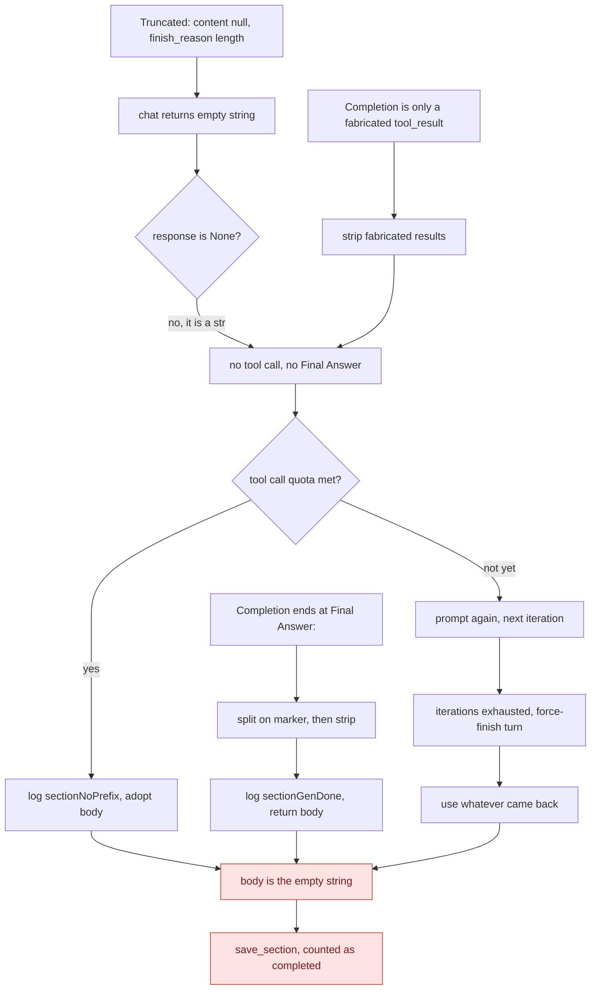
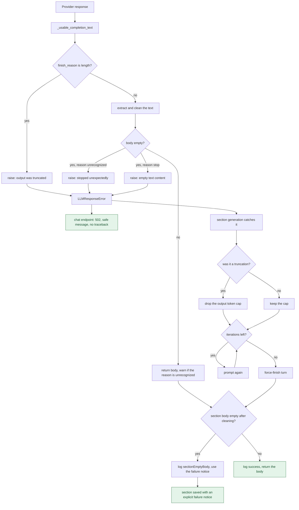

# Issue #814 (Bug 1) — truncated chat completions were reported as empty successes

## 1. The problem

Reported by `tiagouzl` on a local Docker deployment of `ghcr.io/666ghj/mirofish:latest`, with
`openai/gpt-oss-20b` served through NVIDIA's OpenAI-SDK-compatible endpoint. Report generation
died deterministically during Step 4/5, immediately after the `SECTION START` log line of the
first outline section, on two independent runs with different seeds and outlines:

```
报告生成失败: expected string or bytes-like object, got 'NoneType'
```

In the shipped image the traceback pointed at `/app/backend/app/utils/llm_client.py:67`, which
ran `re.sub()` straight over `message.content`:

```python
content = response.choices[0].message.content
content = re.sub(r'<think>[\s\S]*?</think>', '', content).strip()
```

The valuable part of the report is the follow-up, where the reporter traced *why* `content` was
null. It is not intermittent: **`content=None` correlates exactly with `finish_reason='length'`**,
reproduced 6/6 while shrinking the output budget from 2048 down to 64:

| `max_tokens` | `finish_reason` | `content` | `reasoning_content` length | extracted text empty |
| --- | --- | --- | --- | --- |
| 2048 | `length` | `None` | 5873 | yes |
| 1024 | `length` | `None` | 3161 | yes |
| 512 | `length` | `None` | 1738 | yes |
| 256 | `length` | `None` | 1121 | yes |
| 128 | `length` | `None` | 589 | yes |
| 64 | `length` | `None` | 296 | yes |

The full response body for the `max_tokens=64` case shows what the model actually produced:

```json
{"choices":[{"finish_reason":"length","message":{
  "content": null, "reasoning_content":"We need to generate a sequence of 40 terms... The",
  "refusal": null, "role":"assistant", "tool_calls":[]}}],
 "usage":{"completion_tokens":64,"prompt_tokens":92,"total_tokens":156}}
```

The reasoning text ends mid-sentence, on the word "The". That is the whole story: when a
reasoning model exhausts its output budget before it leaves `reasoning_content`, the provider
returns `content: null` with `finish_reason: "length"`, and nothing in that response is a
finished answer.

Two constraints shaped the fix:

- The maintainer's note on the issue — "`reasoning_content` is not automatically a final answer
  and should not be used as an unconditional fallback" — rules out the reporter's first
  suggestion (`content = content or reasoning_content or ''`). The `max_tokens=64` capture above
  is the proof: substituting that partial reasoning would write `We need to generate a sequence
  of 40 terms... The` into a report section as if it were prose. The reporter reached the same
  conclusion and withdrew the suggestion in the same comment. So the fix detects the truncation
  and reports it; it never substitutes partial reasoning.
- The maintainer also noted that on `main@7657031a` "LLM text extraction already handles
  content=None safely", so the `TypeError` belongs to the stale shipped image. That is correct,
  and it is exactly what makes the remaining bug worth fixing: on `main` the crash is gone, but
  nothing took its place. `extract_chat_completion_text()` turns `content=None` into `""`
  (`backend/app/utils/openai_chat_compat.py:70` and `:101`), `chat()` returned that `""`, and
  report generation treated it as a successful answer. The loud, catchable crash had become a
  quiet empty section.

Reproduced against `origin/main` with a fake client replaying the exact response shape above:
`_generate_section_react()` returns `''` after four provider calls, logs the *success* message
`章节 … 未检测到 'Final Answer:' 前缀，直接采纳LLM输出作为最终内容（工具调用: 3次）`, and the
empty string is then persisted and counted as a completed section.

## 2. Root cause

- `backend/app/utils/llm_client.py:156-157` (pre-fix): `chat()` called
  `extract_chat_completion_text()` and returned `_clean_chat_text()` of the result without ever
  looking at `finish_reason`. A truncated completion and a successful one were indistinguishable
  to every caller.
- `backend/app/utils/openai_chat_compat.py:70,101`: the extractor is deliberately tolerant —
  `content=None` becomes `str(content or "")`, i.e. `""`. That is right for an extractor, and
  it is why the `TypeError` disappeared on `main`, but it means the only remaining signal that
  generation failed is `finish_reason`, which `chat()` discarded.
- `backend/app/services/report_agent.py:1351` (pre-fix): the only downstream guard was
  `if response is None`. `""` is not `None`, so it slipped straight through into the ReACT
  state machine.
- Once inside the loop, `""` parses to zero tool calls and contains no `Final Answer:`, so it
  lands in the "model wrote prose without the prefix" branch. With the minimum tool-call quota
  already met it is adopted verbatim as the section body at
  `backend/app/services/report_agent.py:1534-1535` (pre-fix), and the force-finish fallback at
  `:1563` does the same. `generate_report()` then stores it without an emptiness check
  (`:1713`, `:1717`).
- Underneath the reported route there is a more general omission: `_generate_section_react()`
  never inspected the body it was about to return, at any of its three `return` statements. That
  is why two completions the client has no reason to reject — one ending at `Final Answer:` with
  nothing after it, one consisting only of a fabricated `<tool_result>` block — produced the
  same empty, completed-looking section. Fixing only the client would have narrowed the bug
  rather than closed it; section 3 shows all three routes.
- The sibling method already enforced the contract that was missing here: `chat_json()`
  rejected `finish_reason == "length"`, unexpected finish reasons, and empty content. `chat()`
  simply never did.

## 3. Flow before the fix

The truncated response is the reported route into the bug, but it is not the only one. Nothing
between the provider and `save_section()` ever asked whether the section had a body, so three
different completions ended in the same place.



Every landing is silent. `chat()` reports success, the `response is None` guard never fires for
`""`, and no return path inspects `final_answer`, so the empty body is written to
`section_NN.md`, appended to `completed_sections`, and counted in the progress percentage. The
report finishes in state `completed` with a hole in it.

The three routes differ only in where the body is lost:

- **Truncation** — `content: null` with `finish_reason: "length"` extracts to `""`, which the
  client returned as a success. This is the route in issue #814.
- **`Final Answer:` with nothing after it** — `split("Final Answer:")[-1].strip()` yields `""`
  from a completion the client has no reason to reject. Logged as `sectionGenDone`.
- **A response that is only a fabricated `<tool_result>` block** — `_strip_fake_tool_results()`
  removes all of it, and the remainder is adopted. Logged as `sectionNoPrefix`.

The two log lines involved, `sectionGenDone` and `sectionNoPrefix`, both read as successful
adoptions of model output, so nothing in the log suggests a failure either.

## 4. Flow after the fix



Three things now stand between a bad completion and a completed-looking section, and one more
between it and the client.

`chat()` runs the checks `chat_json()` already ran, through a shared helper, and raises the
existing `LLMResponseError` — which carries `finish_reason` and never echoes model output. It
differs from the JSON contract in one respect: an unrecognized `finish_reason` is only fatal
when the body is also empty (section 5 explains why).

Section generation catches it at both call sites and routes it into the missing-response path it
already had: retry inside the ReACT loop while iterations remain, otherwise the explicit
`report.sectionGenFailedContent` notice. When the cause was a truncation, the output token cap
is dropped first, so the retry asks a different question instead of truncating in the same
place. The reason is logged at WARNING for an iteration and ERROR for the force-finish turn;
because `ReportConsoleLogger` attaches a file handler to the `mirofish.report_agent` logger
(`backend/app/services/report_agent.py:335-364`), those lines also reach the console log the UI
streams, so the operator sees *why* a section failed rather than seeing nothing.

Independently of where the completion came from, no return path hands back an empty body any
more. All three sites check `final_answer` and substitute the failure notice, logging
`sectionEmptyBody` instead of a success line.

The one caller that deliberately propagates, `ReportAgent.chat()`, now reaches a handler that
maps the error to 502 with the message only.

Same scenario as section 1, replayed against this branch: six provider calls, the cap dropped
after the first truncation, and the section comes back as the 25-character failure notice
instead of `''`. The three empty-body shapes above come back as the same notice after four
calls.

## 5. What changed

| File | Change | Rationale |
| --- | --- | --- |
| `backend/app/utils/llm_client.py` | New `_usable_completion_text(response, *, kind, strict_finish_reason)` helper; `chat()` uses it with `kind="text"` and the strict flag off; `_parse_json_response()` delegates with `kind="JSON"` and the strict default | One definition of "usable completion" instead of two. `chat_json()` already had the checks; factoring them out is what lets `chat()` share them without inventing a second error vocabulary. The flag is the one place the two contracts legitimately differ |
| `backend/app/services/report_agent.py` | `except LLMResponseError` around both `self.llm.chat()` calls in `_generate_section_react()`; `section_max_tokens` dropped to `None` after a truncation; an emptiness guard on `final_answer` before all three `return` statements | A truncated completion is not section prose, and mapping it onto the missing-response path reuses the retry and force-finish behaviour that already existed. Dropping the cap makes the retry able to succeed. The `final_answer` guards close the empty-section class wherever the body is lost, not just on the reported route |
| `backend/app/api/report.py` | `except LLMResponseError` ahead of the bare handler in the chat endpoint: safe message, no traceback, HTTP 502 | `chat()` now raises where it used to return `""`, so a routine provider truncation was reaching a handler that serialises `traceback.format_exc()` into the response. `graph.py` already mapped this exception type correctly; this reuses that pattern |
| `backend/tests/test_llm_chat_truncation.py` | 26 tests | Pins every branch of the helper, all three empty-body shapes at all three return paths, the cap drop and its deliberate absence, the strict/lenient split on both methods, the 502 mapping, and two guards that must pass before *and* after the fix |
| `locales/en.json`, `locales/zh.json` | `report.sectionIterUnusable`, `report.sectionForceUnusable`, `report.sectionRetryNoTokenCap`, `report.sectionEmptyBody` | The pre-existing keys say "LLM returned None", which is the wrong diagnosis for these paths. Added to both files with identical key sets |

### The client-side check

`backend/app/utils/llm_client.py:103-127`:

```python
    finish_reason = getattr(choices[0], "finish_reason", None)
    if finish_reason == "length":
        raise LLMResponseError(
            f"LLM {kind} output was truncated at the token limit",
            finish_reason=finish_reason,
        )

    unrecognized_finish_reason = finish_reason not in {None, "stop"}
    if unrecognized_finish_reason and strict_finish_reason:
        raise LLMResponseError(
            f"LLM {kind} generation stopped unexpectedly ({finish_reason})",
            finish_reason=finish_reason,
        )

    content = _clean_chat_text(extract_chat_completion_text(response))
    if not content:
        if unrecognized_finish_reason:
            raise LLMResponseError(
                f"LLM {kind} generation stopped unexpectedly ({finish_reason})",
                finish_reason=finish_reason,
            )
        raise LLMResponseError(
            f"LLM returned empty {kind} content",
            finish_reason=finish_reason,
        )
```

`chat_json()` keeps the strict rule, so `_parse_json_response()` (`:306`) is byte-identical in
behaviour to before — the differential in section 6 is what establishes that, not inspection.
`chat()` passes `strict_finish_reason=False` (`:222-226`).

The asymmetry is deliberate, and it is the one place where copying `chat_json()` would have been
wrong. Refusing every `finish_reason` other than `"stop"` is right for JSON: `chat_json()` has a
bounded retry to absorb a false positive, and half a JSON object is worthless anyway. Free text
has no retry, and `LLM_BASE_URL` is explicitly a bring-your-own-endpoint setting — shims and
proxies do report vendor-specific success tokens such as `end_turn`, `eos` or `COMPLETE`.
Discarding a complete section over one of those would be a worse bug than the one being fixed.
So on the text path `"length"` is still always fatal, but another unrecognized reason is fatal
only when the body is *also* empty — and in that case the reason is the better diagnosis, so
"stopped unexpectedly (X)" is raised rather than the vaguer "empty content". A complete body
with an unrecognized reason is returned, with a warning logged (`:129-135`).

### The retry that can succeed

`backend/app/services/report_agent.py:1333` and `:1361-1364`:

```python
        section_max_tokens: Optional[int] = 4096
...
                if e.finish_reason == "length" and section_max_tokens is not None:
                    section_max_tokens = None
                    logger.warning(t('report.sectionRetryNoTokenCap', title=section.title))
```

Both the loop (`:1351`) and the force-finish turn (`:1584`) use that variable, and
`create_chat_completion()` omits the parameter entirely when it is `None`, so the provider falls
back to its own output limit. This mirrors `chat_json()`'s bounded retry
(`backend/app/utils/llm_client.py:288-298`) with one deliberate narrowing: `chat_json()` drops
the cap for any unusable response, whereas here it is dropped only when `finish_reason ==
"length"` actually caused the failure. An empty body with `finish_reason="stop"` is not a budget
problem, and giving up the budget guard would not help. Both halves of that distinction have a
test.

### The guards on the section body

Nothing downstream of `_generate_section_react()` checks what it returns —
`report_agent.py:1755-1759` assigns `section.content`, calls `save_section()` and appends to
`completed_section_titles` unconditionally — so the check has to live at every `return`. All
three are now identical in shape (`:1454-1459`, `:1560-1565`, `:1602-1605`):

```python
            if not final_answer.strip():
                logger.error(t('report.sectionEmptyBody', title=section.title))
                final_answer = t('report.sectionGenFailedContent')
            else:
                logger.info(t('report.sectionNoPrefix', title=section.title, count=tool_calls_count))
```

The `else:` matters as much as the guard: the success log is no longer emitted for a section
that failed.

### The caller side

The `try/except/else` around the ReACT call keeps the old control flow intact — the `else:`
branch exists purely so the original `report.sectionIterNone` log still fires exactly when
`chat()` returns `None` normally, and not on the raise path
(`backend/app/services/report_agent.py:1347-1375`):

```python
            except LLMResponseError as e:
                logger.warning(t('report.sectionIterUnusable', ...))
                ...
                response = None
            else:
                if response is None:
                    logger.warning(t('report.sectionIterNone', ...))
```

Callers of `chat()` were traced before making it raise:

| Call site | Before | After |
| --- | --- | --- |
| `report_agent.py:1348` (ReACT iteration) | `""` flowed on; could be adopted as the section body | caught, logged, cap dropped if truncated, retried |
| `report_agent.py:1581` (force finish) | `""` became the section body | caught, logged, explicit failure notice |
| `report_agent.py:1914`, `:1956` (`ReportAgent.chat`) | returned `{"response": ""}` with HTTP 200 | propagates to `app/api/report.py:678-688`, which returns 502 with the message only |
| `zep_tools.py:1721` (interview summary) | returned `""` as the summary | already wrapped in `except Exception`, so it now falls back to the deterministic roll-up and logs a real reason |
| all `chat_json()` callers | — | unchanged |

## 6. Validation

```
cd backend && PYTHONPATH="$PWD" python -m pytest -q tests/
```

`PYTHONPATH` has to point at `backend/` explicitly: the virtualenv used here installs the
backend as an editable package, so without it `app` resolves to whichever checkout the
`.pth` file names and the wrong tree gets tested silently.

- This branch: **155 passed**. `origin/main`: **129 passed**; the 26 tests in
  `backend/tests/test_llm_chat_truncation.py` are the entire difference.
- `backend/tests/test_llm_json_responses.py` is byte-unchanged and all **17** of its tests still
  pass. That is the first-line protection for the refactor.

The two pieces of evidence that carry the most weight here are the mutation sweep and the
divergence measurement, because they test the claims rather than restating them.

**Mutation sweep: 15 of 15 caught.** Each mutation is a single plausible mistake, applied to a
scratch copy, with the whole suite run against it:

| Mutation | Caught by |
| --- | --- |
| In-loop guard sets `response = ''` instead of `None` | `test_section_retries_a_truncation_even_after_the_tool_quota_is_met` |
| `else:` deleted, so `sectionIterNone` is logged on the raise path too | same test, via its log-key assertions |
| Each of the three `final_answer` guards removed, one at a time | `test_section_never_returns_an_empty_body`, `test_force_finish_never_returns_an_empty_body` |
| Token cap never dropped / dropped on any failure, not just truncation / force-finish re-hardcodes 4096 | `test_section_drops_the_token_cap_after_a_truncation`, `test_section_keeps_the_token_cap_when_truncation_was_not_the_cause` |
| `strict_finish_reason` flipped on `chat()` / on `chat_json()` | `test_chat_keeps_a_complete_body_with_an_unrecognized_finish_reason`, `test_chat_json_still_refuses_any_unrecognized_finish_reason` |
| Specific "stopped unexpectedly" diagnosis replaced by the vaguer empty-content one | `test_chat_reports_unexpected_finish_reason_when_the_body_is_empty` |
| `"length"` check made conditional on the strict flag | four tests, including the end-to-end section test |
| 502 branch removed / downgraded to 500 / leaking a traceback | `test_report_chat_api_maps_an_unusable_response_to_502_without_a_traceback` |

The first two were survivors in an earlier round of this patch; the tests that catch them were
added for that reason. `test_section_retries_a_truncation_even_after_the_tool_quota_is_met` is
the one that mattered: the earlier end-to-end test set `agent.tools = {}`, so the tool-call
quota was never met, the loop always exhausted its iterations, and the in-loop guard was never
actually observed. The new test satisfies the quota first, which is the exact condition under
which the old code returned an empty section.

**Divergence from `main`, measured: 90/109 → 45/109.** Both implementations of `chat()` were
loaded into one process and fed 109 response shapes (every combination of 8 finish reasons
against 13 content payloads, plus missing-choices, missing-message and list-content). The first
revision of this patch changed behaviour in 90 of them; after the lenient finish-reason rule it
changes behaviour in 45 — and the remaining 45 are exactly the truncations and the empty bodies.
Every non-empty body with an unrecognized `finish_reason` now behaves as it did on `main`. That
is the claim the change makes, stated as a number rather than an assurance.

The same harness pins `chat_json()`: `_parse_json_response()` matched `origin/main` on all 109
shapes for exception type, `str()`, `repr()` and the `finish_reason` attribute — **0
mismatches** — and `chat_json()` run end to end on 10 provider sequences at `max_attempts` 1, 2
and 3, including the `response_format` capability negotiation, matched on request count, the
`max_tokens` and `response_format` sent on each request, and the final result: **0 mismatches in
all 30 combinations**. The one bounded content retry still fires on the same conditions and
still drops the token cap on exactly the second request.

Remaining checks:

- Before-fix evidence — copying the first revision's `test_llm_chat_truncation.py` onto an
  `origin/main` checkout and running it there gave **10 failed, 2 passed**. The two that pass
  are the deliberate regression guards (`test_chat_returns_successful_completion_unchanged`,
  `test_chat_still_strips_reasoning_wrapper_from_successful_completion`); they must pass in both
  states, and they do. The ten failures included
  `test_section_generation_degrades_to_an_explicit_failure_notice`, which on `main` dies with an
  unhandled `LLMResponseError` because no call site guards it.
- End-to-end replay of the reporter's response shape through the real `LLMClient` and the real
  `ReportAgent` (three tool-call turns, then `content=None` with `finish_reason="length"`
  forever): `origin/main` returns `''` after 4 provider calls; this branch returns
  `（本章节生成失败：LLM 返回空响应，请稍后重试）` after 6 calls, with `sectionIterUnusable`
  logged twice, `sectionRetryNoTokenCap` once, `sectionForceUnusable` once, and the per-request
  budgets `[4096, 4096, 4096, 4096, None, None]`.
- The same replay for the three empty-body shapes: on `origin/main` all three return `''` after
  4 calls; on this branch all three return the failure notice.
- Locale files: both parse as JSON, both contain **635** keys, the key sets are identical, and
  the placeholder names in the four new strings match their `t()` call sites exactly.
- `python -m compileall` and `git diff --check` are clean.

## 7. Pull request description

Submitted upstream as PR #841 against `666ghj/MiroFish`. Body as filed:

```markdown
## Summary

- `LLMClient.chat()` now rejects a completion that was cut off at the token limit or carries no usable text, instead of returning an empty string that looks like a successful answer.
- Section generation can no longer save an empty body under any circumstances. Every return path in `_generate_section_react()` is guarded, so a completion that passes the client's checks but leaves nothing behind after cleaning also degrades to the explicit "this section failed to generate" notice rather than being adopted as the section.
- A truncation retried inside the ReACT loop now drops the output token cap, mirroring `chat_json()`'s bounded retry, so something actually varies between attempts instead of truncating at the same place six times.
- The report chat endpoint maps an unusable response to **502 with the safe message and no traceback**, matching the mapping `graph.py` already used for this exception type.
- `chat_json()` behaviour, including its error messages and its one bounded retry, is unchanged.
- `reasoning_content` is **not** used as a fallback. Truncated reasoning is not a final answer, so the response is reported as unusable rather than substituted.

## Root cause

`chat()` called `extract_chat_completion_text()` and returned the cleaned result without ever inspecting `finish_reason`. When the output budget is exhausted while a reasoning model is still inside `reasoning_content`, the provider returns `content: null` with `finish_reason: "length"`, so the extractor correctly produced `""` and `chat()` passed that on as a success.

Downstream, `report_agent`'s `if response is None` guard does not fire for `""`, so the empty text flowed through the ReACT loop and a report section could be saved as completed with no content. The sibling `chat_json()` already enforced this contract — `chat()` simply never did.

Validating in the client is necessary but not sufficient. `_generate_section_react()` never checked the body it was about to return, so three further shapes produced the same empty section from a completion the client accepts: a response ending at `Final Answer:` with nothing after it, the same with trailing whitespace, and a response consisting only of a fabricated `<tool_result>` block, which `_strip_fake_tool_results()` empties. All three were logged with the success-shaped `sectionNoPrefix` line and persisted as completed sections. They are now guarded at every return.

## Unrecognized finish reasons

`chat_json()` refuses any `finish_reason` other than `"stop"`, which is right for JSON: it has a retry, and half an object is worthless. Applying that rule unchanged to free text would be a regression. `LLM_BASE_URL` accepts any OpenAI-compatible endpoint, and shims and proxies do report vendor-specific success tokens (`end_turn`, `eos`, `COMPLETE`); on the text path a false positive has no retry to absorb it and would discard a complete section.

So the shared helper takes `strict_finish_reason`. `chat_json()` keeps the strict rule. `chat()` still always rejects `"length"`, and rejects any other unrecognized reason only when the body is also empty — in which case the reason is the more useful diagnosis and is reported instead of "empty content". A complete body with an unrecognized reason is returned, with a warning logged.

## Note on the scope of this revision

This branch originally bundled three separate reports and fixed the null-content case by returning `reasoning_content` as the answer. I've reworked it after the maintainer note on #814 that `reasoning_content` "is not automatically a final answer and should not be used as an unconditional fallback". That's right, and the live reproduction later in that thread shows why: `content: null` tracks `finish_reason='length'` exactly, so the reasoning text in those responses is itself truncated mid-sentence. Detecting the truncation is the useful signal; substituting the partial reasoning would just hide it.

The other two reports are dropped from this branch so it stays reviewable:

- The negative `max_tokens` report is tracked as #837, where the reporter has since established the run died of a host OOM kill rather than that error, and the computation site is still untraced. The mitigation this branch previously carried passed `model_config_dict={"max_tokens": ...}` to `ModelFactory.create`. camel does read that as its `token_limit`, but it also forwards `model_config_dict` verbatim as the per-request body (only `stream` is stripped), so it would have made every request ask for a 64k completion — rejected outright by providers that cap completions lower. Not a safe default, and not a traced root cause, so it needs the repro work in #837 first.
- The provider-error mapping is #836 Part B, and is better off proposed separately against the endpoints it touches.

The chat endpoint's bare `except Exception` still returns a traceback for every other exception type. That is deliberately left alone — tracebacks in report/simulation API responses generally are #745's territory. This branch only fixes it for the one exception type it newly makes common.

## Validation

- `backend/tests/test_llm_chat_truncation.py` covers `finish_reason="length"` with `content=None`, `finish_reason="length"` with partial content, empty/whitespace/reasoning-only content with `finish_reason="stop"`, an unrecognized `finish_reason` with an empty body (rejected) and with a complete body (kept, warned), a response with no choices, and normal completions still returning their text unchanged. It also asserts the error neither contains nor reprs the partial model output.
- Section-level tests cover the path that matters most: the minimum tool-call quota already met, so a truncated response would otherwise have been adopted as the body. That case must take the retry path, must not log the success-shaped line, must not log the "returned None" diagnosis alongside the real reason, and must end at the failure notice after six provider calls. The three empty-body shapes above are covered at each of the three return paths, as are the token-cap drop after a truncation and its deliberate absence when truncation was not the cause.
- The chat endpoint test asserts 502, the safe message, and no traceback anywhere in the body.
- `chat_json()`'s behaviour was checked by differential execution against `main`, not by reading: both implementations of `_parse_json_response()` loaded into one process and fed 109 response shapes (8 finish reasons x 13 content payloads, plus missing-choices, missing-message and list-content), comparing exception type, `str()`, `repr()` and the `finish_reason` attribute — identical on all 109. `chat_json()` then run end to end on 10 provider sequences at `max_attempts` 1, 2 and 3, including the `response_format` capability negotiation, comparing request count, the `max_tokens` and `response_format` sent on each, and the final result — identical in all 30. `chat()` now differs from `main` only where the body is empty or the completion was truncated.
- Mutation-tested: 15 single-point mutations of this patch (each guard removed individually, the in-loop guard returning `''` instead of `None`, the token cap never dropped and dropped too eagerly, the strict flag flipped on each method, the 502 branch removed, downgraded to 500, and leaking a traceback) are all caught by the suite.
- Full backend suite: `155 passed`, with `backend/tests/test_llm_json_responses.py` unchanged and still green.
- `python -m compileall` and `git diff --check` both clean.

I traced the other `chat()` callers before making it raise. `zep_tools.py:1721` already wraps the call in `except Exception` and falls back to a deterministic summary, so it now logs a real reason instead of silently returning an empty one. `ReportAgent.chat()`'s two call sites propagate to the chat endpoint, which is why that endpoint needed the 502 mapping; there is no partial answer worth salvaging on that path, so a stated reason beats a blank reply.

Refs #814 (Bug 1 only)
```

## 8. Known gaps / review notes

What is still open after this branch. The defects found while reviewing it — the traceback on
the chat endpoint, the three unguarded return paths, the missing retry variation and the
over-strict `finish_reason` rule — are fixed, and the reasoning behind each decision is in
section 5 rather than here.

1. **The chat endpoint still returns a traceback for every other exception type.**
   `backend/app/api/report.py:690-696` is a bare `except Exception` that serialises
   `traceback.format_exc()` into the response body at HTTP 500. This branch only intercepts
   `LLMResponseError` ahead of it, because that is the one type it newly makes common. The
   general problem — tracebacks reaching clients from the report and simulation APIs — is PR
   #745's territory, and widening the fix here would collide with it. Worth knowing that the
   endpoint is only half-sanitised.

2. **`ReportAgent.chat()` has no retry at all.** Section generation now drops the output token
   cap and tries again; the conversational path raises on the first truncation and the user gets
   a 502. The asymmetry is defensible — a chat turn is interactive and a stated reason beats a
   long wait — but a single uncapped retry there would probably succeed for the same reason it
   does during section generation. Not attempted in this branch.

3. **A section can still fail after six provider calls.** Dropping the cap makes the retry able
   to succeed, it does not guarantee it: if the completion truncates again at the provider's own
   output limit, or the prompt itself is the problem, the section ends at the failure notice
   having spent five ReACT iterations plus the force-finish turn. That is the honest outcome and
   it is bounded, but it is not cheap, and nothing currently detects "this section has failed
   the same way twice, stop trying".

4. **`extract_chat_completion_text()` cannot read a list of bare strings.**
   `backend/app/utils/openai_chat_compat.py:75-99` handles a list of content *parts* (dicts, or
   objects with `.text`/`.content`), but a provider returning `content: ["chunk", "chunk"]`
   yields `""`. Pre-existing, and the new check at least converts it from a silently empty
   section into a reported failure, so it is now loud rather than invisible — but the shape
   still is not supported.

5. **The test helpers are duplicated, deliberately.** `CompletionSequence`, `_response()` and
   `_client_for()` in `backend/tests/test_llm_chat_truncation.py:15-46` are copies of
   `backend/tests/test_llm_json_responses.py:8-46`. Moving them to a `conftest.py` was
   considered and rejected: `test_llm_json_responses.py` has to stay byte-unchanged in this
   branch, since it is the independent evidence that the `chat_json()` refactor did not alter
   behaviour, and it defines its own copies. Extracting the shared versions without touching it
   would leave three copies instead of two. Worth doing in a follow-up that is allowed to edit
   both files.

6. **Only `choices[0]` is ever examined.** Both the extractor and the new check look at the
   first choice and ignore the rest, so a response whose first choice was truncated while a
   later one completed is reported as a failure. Nothing in this codebase requests `n > 1`, so
   this is theoretical today; it would become real the moment something did.
