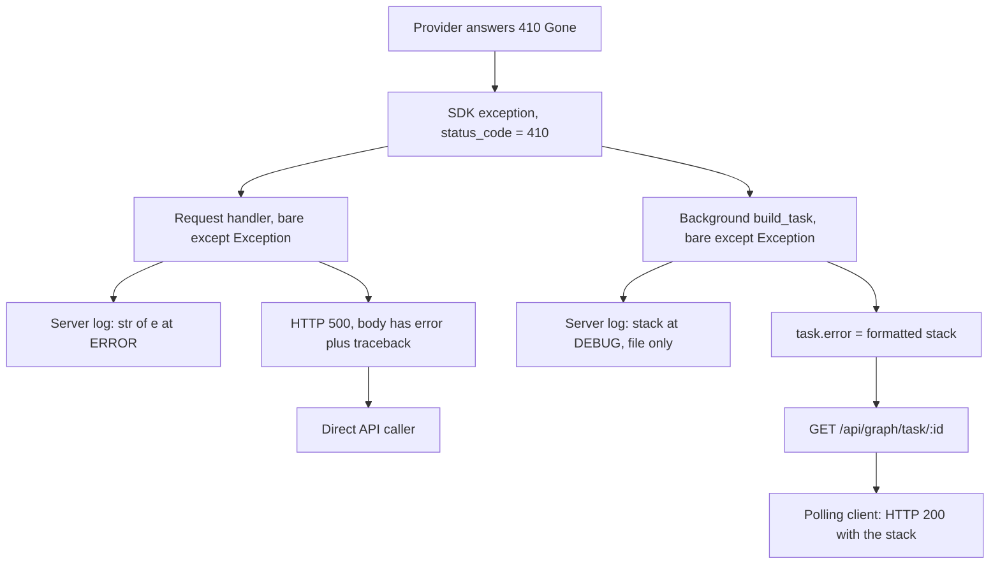
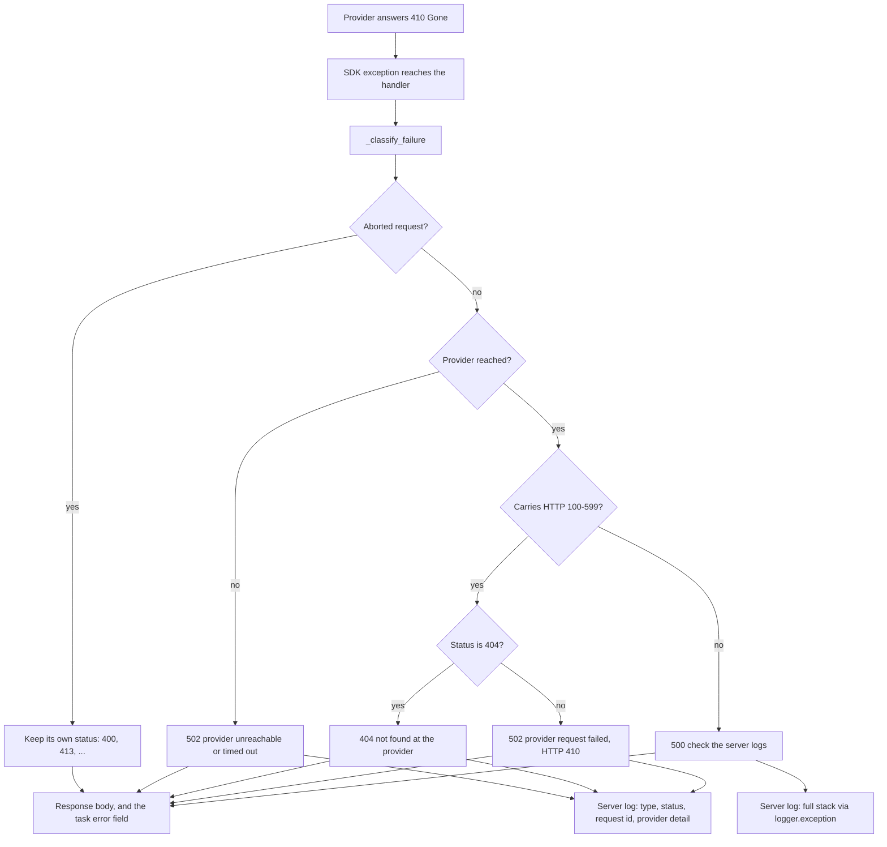

# Issue #836 (Part B) — Map provider failures in the graph API to actionable statuses and stop returning tracebacks

## 1. The problem

Issue #836 was split out of #814 by `tiagouzl`, running a local Docker deployment of
`ghcr.io/666ghj/mirofish@sha256:d236402eb35c5abfd68da63be9d19202d619da8803e173e8e34b97731180944a`.

The report has two halves.

**Part A — the model is dead.** `openai/gpt-oss-120b` now answers `410 Gone` on the NVIDIA API,
reproduced live by the reporter:

```
APIStatusError 410
Error code: 410 - {'type': 'about:blank', 'title': 'Gone', 'status': 410,
 'detail': "The model 'openai/gpt-oss-120b' has reached its end of life on
 2026-09-03T08:00:00Z and is no longer available."}
```

Two things matter about that payload. The first is that any config pointing at this model fails
outright. The second is the *shape*: it is `{'type': 'about:blank', 'title': 'Gone', ...}`, not the
`{'error': {...}}` envelope that normal provider errors use. A `410` in this shape will not pass
through body-parsing code written against the `{'error': ...}` envelope — which is precisely why the
fix below reads the exception's `status_code` attribute and never parses a provider body at all.

Part A itself is **not fixable by any pull request.** The published `latest` image was built
`2026-03-07T13:47:35Z` — roughly seven months stale as of the report — and `latest` has not moved
since, so everyone pulling it today gets the same build. Shipping a current image is a release
action that needs a maintainer to publish; there is no code change that can substitute for it. This
document covers Part B only.

**Part B — provider errors were not mapped, so failures were undiagnosable.** The reporter
confirmed in the published image that `backend/app/api/graph.py` had five call sites each wrapping
the provider call in a bare `except Exception` that logged only `str(e)`. No `502` branch, no
`LLMResponseError` branch, no passthrough of the provider's own status. So every provider-side
failure — the `410` above, a rate limit, an auth error, a timeout — reached the user as a generic
`500` with nothing actionable in it.

The reporter's summary of the combined effect is the sharpest statement of the bug: a user pointing
config at a dead model "gets a bare `500` and has nothing to diagnose it with, not even in the
logs. The 410's response shape makes it worse: a dead model is exactly the case you *can* diagnose
from the error, and this build is what throws that information away."

There is a second, quieter problem in the same handlers that the report does not mention: those
`500` responses did not merely lack information, they carried too much of the wrong kind. Three of
them put `traceback.format_exc()` straight into the JSON response body, and the background build
task stored a formatted stack in the task's `error` field, which `/api/graph/task/<id>` hands back
verbatim.

## 2. Root cause

All line numbers below are against `origin/main` as it stood before this change.

One handler already did the right thing. `generate_ontology()` learned to classify provider
failures in #742 and carries a full three-way branch at `backend/app/api/graph.py:394`.

The other four kept the original shape:

| Site | Bare handler | Traceback into the response |
| --- | --- | --- |
| background `build_task()` | `backend/app/api/graph.py:801` | `backend/app/api/graph.py:815` (`error=traceback.format_exc()`) |
| `POST /api/graph/build` | `backend/app/api/graph.py:834` | `backend/app/api/graph.py:838` |
| `GET /api/graph/data/<graph_id>` | `backend/app/api/graph.py:899` | `backend/app/api/graph.py:903` |
| `DELETE /api/graph/delete/<graph_id>` | `backend/app/api/graph.py:958` | `backend/app/api/graph.py:962` |

Each of the three request handlers returned `{"error": str(e), "traceback": traceback.format_exc()}`
with a hardcoded `500`. The status was a constant, so a provider failure and a genuine server bug
were indistinguishable to the caller.

The background task is the interesting one, because its leak is indirect. At
`backend/app/api/graph.py:815` it wrote the formatted stack into the task record, and
`backend/app/models/task.py:51` includes `error` in `Task.to_dict()`, which
`backend/app/api/graph.py:857-860` (`get_task`, defined at `:845`) returns inside a `200 OK`. A
client that only ever
polled `/api/graph/task/<id>` — never calling a failing endpoint itself — received the stack.
Separately, `backend/app/api/graph.py:804` logged the stack with `build_logger.debug(...)`; the
console handler is `INFO` and up (`backend/app/utils/logger.py:81`), so the stack went to the
rotating file but never to `docker logs`, which matches the reporter's observation that there was
nothing in the logs.

On reading the status rather than the body: both SDKs expose the status as an attribute.
`zep_cloud/core/api_error.py` declares `ApiError.status_code: Optional[int]` and sets it in
`__init__`; `openai/_exceptions.py` declares `APIStatusError.status_code: int` and
`request_id: str | None`. Reading those attributes is shape-independent, so the `about:blank`
payload from the 410 is classified correctly without anyone having to know its schema.

## 3. Flow before the fix

A provider `410 Gone` had no route to the client that preserved the `410`, and two routes that
leaked the stack: directly in the response body, and indirectly through the task record.



The left branch is the obvious one: status collapsed to a constant `500`, and the stack shipped to
whoever called the endpoint. The right branch is the one worth dwelling on, because the polling
client is not the party that triggered the failure and has no reason to be handed server internals.
It asked a status question and got a stack frame listing filesystem paths and the exception message.

## 4. Flow after the fix

`_classify_failure()` runs the same exception through an ordered set of questions, and the status it
returns is the answer to "what should the caller do about this?" rather than a constant. An aborted
request keeps the status it already carries. A provider that was never reached is a gateway failure
even though there is no upstream status to quote. A provider that answered gets its status
interpreted: `404` means the thing is absent, anything else means the upstream call failed. Only a
failure that fits none of these is a `500`.



The split down the right-hand side is the part that matters most, and it is not symmetrical. The
response carries the status, a short message and — when the exception exposes one — a sanitized
`request_id`. It never carries a provider body, because those can echo request content.

The log carries the provider's own message as well. That asymmetry is the whole point. Issue #836's
complaint is that a user "gets a bare `500` and has nothing to diagnose it with, not even in the
logs", and a log line reading only `status=410` does not answer that: an operator still cannot tell
*which* model died. So the classified branches log `type`, `status`, `request_id` and the provider's
`detail`, while the unexplained branch logs a full stack — because for a failure nobody can explain,
the stack *is* the diagnostic. A stack is logged exactly when, and only when, the classifier has
nothing better to say.

The background task now stores the same safe string in `task.error`, so the indirect path from
section 3 carries what the direct path carries. The `log=` keyword routes its classification into
`mirofish.build` rather than `mirofish.api`, so the build log stays the single place to read a build
failure.

## 5. What changed

Line numbers in this section are post-fix, against this branch.

| File | Change | Rationale |
| --- | --- | --- |
| `backend/app/api/graph.py` | Added `_classify_failure()` and three small helpers; applied the classifier at the four bare `except Exception` handlers; `request.get_json(silent=True)`; removed `import traceback` | One place decides the status, the public message and what gets logged, so the four sites cannot drift apart again. The import went with its last use. |
| `backend/tests/test_graph_provider_errors.py` | New, 45 tests | Covers the whole mapping at all four sites, the response/log split, request-id extraction from both SDK shapes, sanitization, and the absence of a traceback in every response including the task endpoint. Fixtures are built from the real SDK exception classes. No network, Zep or LLM call. |

The mapping the classifier implements:

| Failure | Response status | Public message |
| --- | --- | --- |
| Provider `404` (`zep_cloud.NotFoundError`, `openai.NotFoundError`) | `404` | not found at the provider, plus `request_id` |
| Transport failure or timeout (`httpx.TransportError`, `openai.APIConnectionError`) | `502` | provider unreachable or timed out |
| Any other provider status (`410`, `429`, `401`, `403`, `5xx`, …) | `502` | upstream status, plus `request_id` |
| `werkzeug.HTTPException` (`flask.abort`, a rejected body) | passthrough (`400`, `413`, …) | the exception's own `description` |
| `LLMResponseError` | `502` | `str(error)` |
| Anything else | `500` | generic; check the server logs |

### Reading the status, not the body

`_provider_status()` at `backend/app/api/graph.py:124-141`:

```python
    status = getattr(error, "status_code", None)
    if isinstance(status, int) and 100 <= status <= 599:
        return status
    return None
```

Both SDKs put the status on an attribute — `zep_cloud` on `ApiError.status_code`, `openai` on
`APIStatusError.status_code` — so nothing here parses a provider body. That is what makes it work
for #836 at all: the retired model answers `410` with `{'type': 'about:blank', 'title': 'Gone', ...}`
rather than the `{'error': {...}}` envelope, and would not survive body parsing.

The range check does two jobs. `bool` is a subclass of `int` in Python, so a bare
`isinstance(status, int)` accepts `True` and renders it as "HTTP True"; `100 <= True` is `False`, so
the range rejects it without needing a separate `not isinstance(..., bool)` clause. It also rejects
nonsense integers — `0`, `-1`, `99999` — that would otherwise be presented to a caller as an HTTP
status.

### Finding the request id in two different places

`_provider_request_id()` at `backend/app/api/graph.py:144-171`:

```python
    try:
        request_id = getattr(error, "request_id", None)
        if request_id:
            return str(request_id)

        headers = getattr(error, "headers", None)
        items = getattr(headers, "items", None)
        if not callable(items):
            return None
        for name, value in items():
            if str(name).lower() == "x-request-id" and value:
                return str(value)
    except Exception:  # noqa: BLE001 - never let id lookup mask the failure
        logger.debug("Could not read a request id from %s", type(error).__name__)
    return None
```

The two SDKs disagree, and the disagreement is easy to miss. `openai`'s `APIStatusError` sets
`request_id` directly in `__init__`, reading it off the response headers for you. `zep_cloud`'s
`ApiError` has **no `request_id` attribute at all** — `hasattr(error, "request_id")` is `False` — and
leaves the id in `error.headers`. Since every one of the four handlers reaches this code through
`GraphBuilderService`, which talks only to Zep, reading the attribute alone would have dropped the id
on every path that can actually occur. Hence the header fallback, and hence the case-insensitive
scan: real responses vary the casing and `zep_cloud` hands back a plain `dict`, not a
case-insensitive mapping. The same scan pattern already exists for `retry-after` at
`backend/app/utils/zep.py:110-117`.

The `try`/`except` is not decoration. This function runs *while* an error is being handled, so an
exception object whose `headers` property raises would have replaced the failure being reported with
a new one — and on the background path that would have skipped the `ProjectStatus.FAILED` write
below it, leaving the project stranded in `GRAPH_BUILDING` forever. A request id is a nicety; losing
it is the correct outcome when it cannot be read.

### Sanitizing what gets echoed

`_public_request_id()` at `backend/app/api/graph.py:173-184` drops anything outside
`[a-zA-Z0-9._:-]` and caps the result at 128 characters. It is an allowlist rather than a denylist on
purpose: CR, LF, NUL, quotes, angle brackets, ANSI escapes and Unicode line separators such as
`U+2028` all disappear without anyone having to enumerate them. The caller's `if safe_request_id:`
guard means an id consisting entirely of rejected characters is omitted rather than producing a
dangling `(request_id: )`.

Worth being accurate about the threat model: this value is interpolated into a JSON response body
and into log lines, never into a response header. So the risks are body-context escaping and
log-line forgery, not CRLF header injection.

### Classifying what never reached the provider

`backend/app/api/graph.py:219-231`:

```python
    if isinstance(error, (httpx.TransportError, APIConnectionError)):
        target_log.error(
            "%s could not reach the provider: type=%s detail=%s",
            operation,
            type(error).__name__,
            error,
        )
        return "Provider unreachable or timed out", 502
```

These carry no status to pass through — `zep_cloud` does not wrap `httpx` transport errors, so a Zep
connection failure arrives as a raw `httpx` exception, and `openai`'s connection errors subclass
`APIError` rather than `APIStatusError` and so have no `status_code` either. They were therefore
falling into the generic `500` branch, which reports a gateway failure as a server bug. The two types
chosen cover their own timeout subclasses: `httpx.TransportError` covers `ConnectError`,
`ConnectTimeout`, `ReadTimeout`, `NetworkError`, `ProtocolError` and `ProxyError`, and
`openai.APIConnectionError` covers `APITimeoutError`.

`OSError`, `ConnectionError` and `TimeoutError` are deliberately **not** in that tuple, even though
`is_retryable_zep_error` at `backend/app/utils/zep.py:92-104` does include them. `TimeoutError` and
`ConnectionError` are both `OSError` subclasses — and so is `FileNotFoundError`. `zep.py` can afford
the broad catch because it wraps a single Zep read; `_classify_failure` wraps whole request handlers
that also do local disk I/O through `ProjectManager.save_project`, so catching `OSError` there would
report a full disk during a project save as "provider unreachable". The precision matters more than
the symmetry.

### Keeping a bad request a 4xx

`backend/app/api/graph.py:640` now reads `request.get_json(silent=True)`, matching the pre-read
already in `build_graph()` at `:594`. Without `silent=True`, a malformed body raised werkzeug's
`BadRequest` — an `Exception`, and so caught by the bare handler and flattened into a `500` telling
the caller to go read server logs for their own typo. With it, a bad body becomes `{}` and falls
through to the existing `project_id` validation, which already returns a localized, actionable
`400`.

`_classify_failure` also handles `HTTPException` directly, at `backend/app/api/graph.py:204-210`,
passing the status and `description` through. It does **not** re-raise, which would be the more
obvious implementation: no JSON error handler is registered anywhere in `backend/app/`, so
re-raising hands the request to Flask's default handler and returns an HTML error page from a JSON
API. Passing the status through preserves both the status *and* the `{"success": false, "error": ...}`
shape every other response from these endpoints uses. With `silent=True` in place this branch is
defensive rather than load-bearing, which is why it is tested by calling the classifier directly.

### The background handler

`backend/app/api/graph.py:944-962` is where the indirect leak from section 3 is closed:

```python
except Exception as e:
    # 任务状态会直接回传给客户端，只写入安全信息，堆栈留在服务端日志
    public_error, _ = _classify_failure(
        e, "Graph build", log=build_logger
    )
    build_logger.error(f"[{task_id}] 图谱构建失败: {public_error}")
    ...
            task_manager.update_task(
                task_id,
                status=TaskStatus.FAILED,
                message=t('progress.buildFailed', error=public_error),
                error=public_error
            )
```

The status is discarded here (`public_error, _`) because a background task has no HTTP response to
attach it to — the task record carries only the message, and the request that started the build
already returned `200`.

### Why `generate_ontology()` stays duplicated

`_classify_failure()` is a near-exact extraction of the block at
`backend/app/api/graph.py:536-564`, and it deliberately does not replace it.

That block does more than classify. It also flips `project.status` to `FAILED`, persists
`project.error`, and wraps the persistence in its own `try`/`except` at `:570-576` so a save failure
during error handling does not mask the original error. Folding it into the helper would mean either
widening the helper's contract to cover project persistence — which none of the four call sites need
— or leaving the persistence behind and still editing the block, which widens the diff across code a
maintainer wrote deliberately in #742 and invites a conflict for no behavioural gain. The change is
therefore purely additive with respect to that function: zero diff hunks fall in its range, it is
byte-identical to `origin/main`, and `tests/test_ontology_api_errors.py` passes unchanged.

The duplication is the cheaper of the two costs. It is worth noting explicitly so a future reader
does not "clean it up" without understanding that the asymmetry is intentional.

## 6. Validation

```
cd backend && PYTHONPATH=$PWD python -m pytest -q tests/
```

- On `origin/main`: `129 passed`.
- On this branch: `174 passed` — the same 129 plus 45 new tests.
- `tests/test_ontology_api_errors.py` passes unchanged (`2 passed`); the file is not in the diff.
- `python -m compileall -q app/` clean, `git diff --check` clean, and no remaining reference to
  `traceback` anywhere in `graph.py` — including inside strings and nested functions.
- Stable across ordering: three consecutive randomized runs and one `-p no:randomly` run all give
  `174 passed`, and running the new file twice in a single session gives `90 passed`, so the
  log-capture handlers do not leak between tests.

**Each fix is independently guarded, not collectively asserted.** This is the most informative
number in this document. Running the new test file against the two earlier states of the code:

| Test file run against | Result |
| --- | --- |
| `origin/main` — no fix at all | **45 failed** (every test) |
| `bbbdced` — the first pass, before review | **32 failed, 13 passed** |

The first row shows the suite as a whole depends on the change. The second is the useful one: it
isolates what the review-driven corrections actually bought, and shows that each behavioural fix has
its own failing test rather than being swept up in a single broad assertion. The 32 failures break
down as both `404` tests, all five transport parameters, all four non-status `status_code`
parameters, the provider-detail-in-the-log test, the Zep-request-id-from-headers test, all three
`HTTPException` parameters, all three malformed-body parameters, and the three original provider
tests that now fail because the Zep request id can only be read from a header.

**Fixtures are built from the real SDK classes** — `zep_cloud.core.api_error.ApiError`,
`zep_cloud.NotFoundError`, `openai.RateLimitError`, `openai.NotFoundError`, `openai.APITimeoutError`,
`httpx.ConnectError` — rather than hand-rolled stand-ins. That is not fastidiousness: the first pass
used a fake that set both `status_code` and `request_id` as instance attributes, which passes against
any code that only reads attributes and therefore hid the fact that `zep_cloud` never sets
`request_id` at all. A fake that is more cooperative than the real dependency tests nothing. One test
asserts `not hasattr(error, "request_id")` on the Zep fixture outright, so the divergence cannot
quietly return.

**The response/log split is asserted in both directions.** For the `410`, one test checks that
`openai/gpt-oss-120b` and `has reached its end of life` appear in the captured log, and that
`gpt-oss-120b` does *not* appear in the response body. The log line in full:

```
Graph data request failed at the provider: type=ApiError status=410 request_id=rid-410
detail=headers: {'X-Request-Id': 'rid-410'}, status_code: 410, body: {'type': 'about:blank',
'title': 'Gone', 'status': 410, 'detail': "The model 'openai/gpt-oss-120b' has reached its
end of life on 2026-09-03T08:00:00Z and is no longer available."}
```

The detail is deliberately not truncated. `zep_cloud`'s `ApiError.__str__` renders `headers` first,
so a length cap would cut off exactly the `detail` field that makes the line worth reading; the
rotating file handler already bounds disk use. Capturing these records needs a handler of its own
rather than pytest's `caplog`, because `backend/app/utils/logger.py:49` sets `propagate = False` and
`caplog` hooks the root logger.

**Before-fix evidence, and why the traceback removal belongs in this change.** In the before-fix run,
`GET /api/graph/task/<id>` returned `200 OK` with this in `data.error`:

```
Traceback (most recent call last):
  File ".../backend/app/api/graph.py", line 709, in build_task
    graph_id = builder.create_graph(
  ...
RuntimeError: ZEP_API_KEY=hunter2
```

and `data.message` was `构建失败: ZEP_API_KEY=hunter2`. The `ZEP_API_KEY=hunter2` string came from a
deliberately planted exception message, not from real code reading a real key — but that is the
point. A stack in a response body is not just noise. Whatever happens to be in an exception message
anywhere down the call stack becomes readable by whoever is polling, and exception messages are
written by code that was not thinking about the HTTP boundary.

The background path also gained logging it never had. The old code logged its stack with
`build_logger.debug(...)`, and the console handler is `INFO` and up
(`backend/app/utils/logger.py:81`), so that stack reached the rotating file but never `docker logs` —
which matches the reporter's observation that there was nothing in the logs. It is now an `ERROR`
with `exc_info`, so it reaches both.

**Locale check.** The change adds no locale keys. `locales/en.json` and `locales/zh.json` have no
diff hunks against `origin/main`, both parse as valid JSON, and both flatten to the same 631 keys
with an identical key set. The one already-localized string involved,
`t('progress.buildFailed', error=public_error)`, is reused unchanged: `progress.buildFailed` is
`"Build failed: {error}"` in `en.json` and `"构建失败: {error}"` in `zh.json`, and
`backend/app/utils/locale.py:59-61` substitutes `{error}` from the `error=` keyword, so the
placeholder still matches its call site. The interpolated value is now a controlled string rather
than arbitrary provider text, which incidentally also means it can no longer contain stray `{...}`
sequences.

**No frontend change needed.** `frontend/src/api/index.js:38-58` surfaces `response.data.error` for
any non-2xx without branching on the status code, and `frontend/src/api/graph.js:49` is the only
consumer of `/api/graph/data`, so the new `404` and `502` statuses reach the existing error display
unchanged. `delete_graph` already returned `404` for "No local project references this graph", so
`404` is not a new status for this blueprint.

**SDK shapes verified against the installed packages** (`zep_cloud` 3.25.0, `openai` 1.109.1):
`zep_cloud`'s `ApiError` and its subclasses, including `NotFoundError` (which hardcodes
`status_code=404`), expose `status_code` as an `int` but have no `request_id`;
`openai.APIStatusError` and its subclasses expose both; `openai.APIConnectionError` and
`APITimeoutError` expose neither.

## 7. Pull request description

Reproduced verbatim from the PR body.

> ## Summary
>
> - Map provider-side failures in the graph API to a status the caller can act on, instead of a flat `500`. A failure the provider explained keeps a meaningful status, a provider that could not be reached is a `502`, and only an unexplained failure is a `500`.
> - Extract `_classify_failure()` in `app/api/graph.py` and use it at the four remaining bare `except Exception` handlers: the background build task, the `/api/graph/build` request handler, `/api/graph/data/<graph_id>` and `/api/graph/delete/<graph_id>`.
> - Stop returning `traceback.format_exc()` to clients. Three of those handlers put the stack straight in the response body; the background build task also stored it in the task's `error` field, which `/api/graph/task/<id>` and `/api/graph/tasks` return verbatim — so a polling client received the stack even though it never called a failing endpoint directly. Both paths now carry the safe public message, and the stack goes to the server log only.
> - Keep the provider's own explanation server-side. The response never carries a provider body, but the log does, because that body is the only thing that distinguishes a retired model from a bad key.
>
> The resulting mapping:
>
> | Failure | Response status | Public message |
> | --- | --- | --- |
> | Provider `404` (`zep_cloud.NotFoundError`, `openai.NotFoundError`) | `404` | resource not found at the provider, plus `request_id` |
> | Provider timeout or connection failure (`httpx.TransportError`, `openai.APIConnectionError`) | `502` | provider unreachable or timed out |
> | Any other provider status (`410`, `429`, `401`, `5xx`, …) | `502` | upstream status, plus `request_id` |
> | `werkzeug` `HTTPException` (`flask.abort`, a rejected body) | passthrough (`400`, `413`, …) | the exception's own description |
> | Anything else | `500` | generic; check the server logs |
>
> A provider `404` deliberately does not become a `502`. Absent is not broken, and a `502` tells every proxy and retry layer in the path that the upstream is down — so a stale or mistyped graph id would be retried and could page someone. `graph.py` already draws this distinction when it treats `NotFoundError` as "already deleted" in `_delete_cloud_graph_if_present`.
>
> Conversely, a timeout or a refused connection has no status at all to pass through — `zep_cloud` does not wrap `httpx` transport errors, and `openai`'s connection errors are not `APIStatusError` subclasses — but those are squarely gateway failures rather than server bugs, so they are classified as `502` by type.
>
> `_classify_failure()` deliberately does **not** replace the near-identical block in `generate_ontology()` (the one added in #742). That endpoint has extra project-persistence and `LLMResponseError` behaviour that was written deliberately, so folding it in would widen the diff and invite a conflict for no benefit; this PR is purely additive to that function. The apparent duplication is intentional, and `tests/test_ontology_api_errors.py` passes unchanged.
>
> ## Root cause
>
> `generate_ontology()` learned to classify provider failures in #742, but the other handlers in `app/api/graph.py` kept the original shape: a bare `except Exception` that logs `str(e)` and returns `{"error": str(e), "traceback": traceback.format_exc()}` with `500`. There was no `502` branch and no passthrough of the provider's own status, so every provider-side failure — an auth error, a rate limit, a timeout — arrived as an undiagnosable `500`.
>
> The case that surfaced this: `openai/gpt-oss-120b` now answers `410 Gone` ("has reached its end of life"). Pointing config at that model produced a generic `500` with nothing actionable in it. The `410` body is `{'type': 'about:blank', 'title': 'Gone', 'status': 410, ...}`, not the `{'error': {...}}` shape other provider errors use, so this reads the exception's `status_code` attribute rather than parsing any provider body. Both SDKs expose it as an attribute, which makes the classification shape-independent.
>
> Reading the attributes has one wrinkle worth recording: `openai`'s `APIStatusError` exposes `request_id` directly, but `zep_cloud`'s `ApiError` has no such attribute at all and leaves the id in the response headers. Since all four of these handlers talk to Zep, reading only `error.request_id` would drop the id on every path that can actually reach this code, so `_provider_request_id()` falls back to a case-insensitive `x-request-id` header scan.
>
> The status check is `isinstance(status, int) and 100 <= status <= 599` rather than a bare `isinstance`. `bool` is a subclass of `int` in Python, so a `status_code` of `True` would otherwise have rendered as "HTTP True", and the range also rejects nonsense values like `0` or `99999`.
>
> ### What reaches the client, and what reaches the log
>
> The point of the change is that these are different sets. Provider bodies can echo request content, so the response is limited to the upstream status plus a sanitized, length-capped `request_id`.
>
> The server log is the opposite case. #836's complaint is that a user "gets a bare `500` and has nothing to diagnose it with, not even in the logs", and a log line that says only `status=410` does not fix that — an operator still cannot tell *which* model died. So the provider's own message is logged at error level alongside the type, status and request id. For the `410` above the log now carries `The model 'openai/gpt-oss-120b' has reached its end of life on 2026-09-03T08:00:00Z and is no longer available.`, while the response carries only `Provider request failed (HTTP 410) (request_id: ...)`.
>
> A stack is logged whenever — and only when — the failure could not be explained, which is the one case where the stack is the diagnostic.
>
> That is also a quiet improvement to the background build path. The old code logged its stack with `build_logger.debug(...)`, and the console handler is `INFO` and up, so that stack only ever reached the rotating log file and never `docker logs` — matching the reporter's observation that there was nothing in the logs. It is now an `ERROR` with `exc_info`, so it reaches both.
>
> On the traceback removal being worth doing in the same change: a stack trace in a response body is not only noise, it can carry configuration. In the before-fix test run, one response body contained `RuntimeError: ZEP_API_KEY=hunter2` from a deliberately planted exception message — which is exactly the shape of accident this closes.
>
> ### Malformed request bodies
>
> `_build_graph_impl()` called `request.get_json()` without `silent=True`, so a malformed body raised `werkzeug`'s `BadRequest` — an `Exception`, and therefore caught by the bare handler and flattened into a `500`. It now matches the `silent=True` pre-read already in `build_graph()`, which means a bad body falls through to the existing `project_id` validation and returns an actionable, localized `400`. `_classify_failure()` also passes any other `HTTPException` through with its own status rather than re-raising, since these endpoints answer in JSON and Flask's default error page is HTML.
>
> ## Validation
>
> - `cd backend && PYTHONPATH=$PWD python -m pytest -q tests/` → `174 passed` (129 before this PR, plus 45 new tests). `compileall` and `git diff --check` clean.
> - Reverting only the `graph.py` change makes all 45 new tests fail.
> - `tests/test_ontology_api_errors.py` passes unchanged, confirming the #742 handler was not disturbed; it is byte-identical to `main` and there are no diff hunks in its range.
> - The new tests build their fixtures from the real SDK exception classes — `zep_cloud.core.api_error.ApiError`, `zep_cloud.NotFoundError`, `openai.RateLimitError`, `openai.NotFoundError`, `openai.APITimeoutError`, `httpx.ConnectError` — rather than hand-rolled stand-ins, specifically so that a divergence like `ApiError` having no `request_id` cannot pass unnoticed. They run against a monkeypatched service layer: no network, Zep or LLM call.
> - Coverage includes the status mapping at all four sites, the provider detail reaching the log while staying out of the response, the stack being logged for an unexpected failure and not for a classified one, request-id extraction from both SDK shapes, request-id sanitization (CR, LF, CRLF, NUL, ANSI escapes, `U+2028`, angle brackets, JSON break-out), the empty-after-sanitization and over-length cases, non-status `status_code` values, and malformed request bodies.
> - Error strings are plain English rather than new locale keys, matching the local precedent in the ontology block for these safe messages. The one already-localized string, `t('progress.buildFailed', error=...)`, is reused unchanged with a safe interpolation, so the `en.json` / `zh.json` key sets stay identical.
> - The frontend needs no change: `frontend/src/api/index.js` surfaces `response.data.error` for any non-2xx without branching on the status code, so the new statuses pass through to the existing error display.
>
> Refs #836. This addresses only the second half of the report, the undiagnosable `500`s. The first half — the `latest` image being roughly seven months stale — is a release action rather than a code change, so no PR can fix it; that needs a maintainer to publish a fresh image.
>
> Two adjacent spots are deliberately untouched. `app/api/simulation.py` has the same traceback-in-response shape, but that is #745's territory. And `GraphBuilderService.build_graph_async` still writes `f"{str(e)}\n{traceback.format_exc()}"` into a task's `error` field at `app/services/graph_builder.py:215` — the same indirect leak this PR closes in the API layer. It is currently unreachable, with no callers anywhere in the application, so fixing it here would widen the scope for no behavioural change; it should be removed or corrected before anything starts calling it.

## 8. Known gaps / review notes

What is still open after this change. The review that drove the corrections in section 5 is not
repeated here — where a finding led to a fix, the reasoning lives next to the code it explains.

**1. `429` and `503` lose their retry semantics, and a maintainer should decide whether that is
acceptable.** This is the one open design question in the change. Collapsing every non-`404`
provider status into `502` is a clear improvement on an undifferentiated `500`, but `502` still
conflates conditions a caller would want to treat differently:

| Upstream | What a caller should do | What it gets |
| --- | --- | --- |
| `429`, `503` | retry after a delay | `502` |
| `410` | stop; reconfigure the model | `502` |
| `401`, `403` | stop; fix the server's credential | `502` |

A client cannot derive a retry policy from `502` alone — it has to string-match the status out of
the message text, which is exactly the kind of coupling a status code exists to avoid. Passing `429`
and `503` through with a `Retry-After` header (the information is available: `zep_cloud`'s `ApiError`
carries the response headers, and `backend/app/utils/zep.py:107-123` already parses `retry-after`
from them) would give callers something actionable. Keeping `401`/`403` as `502` is defensible —
the rejected credential is the server's, not the caller's, so a `4xx` would misattribute blame —
though it does mean an unauthenticated caller learns that the server's provider credential is being
rejected, and it invites retries for a misconfiguration that will never succeed on its own.

This was left out deliberately: it changes the response contract in a way that deserves a
maintainer's call rather than a reviewer's, and it is additive to what is here.

**2. The `LLMResponseError` branch is unreachable from every call site that uses the helper.**
`backend/app/api/graph.py:215-217` cannot fire for any of the four. `LLMResponseError` is raised only
in `app/utils/llm_client.py`, whose consumers are `OntologyGenerator`, `zep_tools` and
`report_agent`; `graph_builder.py` makes no LLM call at all. The one handler that *can* raise it,
`generate_ontology()`, is the one deliberately left with its own inline copy (section 5). The branch
is therefore dead code that no test can cover, and it carries an explanatory comment saying so. It is
kept rather than deleted so the helper stays correct if an LLM-backed caller is ever pointed at it,
but it is also the main reason the helper *looks* like it generalises the #742 block when it does
not.

On that branch's own safety, since it is the one place that returns `str(error)` to a client: all
nine raise sites in `app/utils/llm_client.py:232-288` use fixed English strings plus, at most, a
`finish_reason` and the `lineno`/`colno` integers from a `JSONDecodeError`. No model output and no
provider body is interpolated, so returning the string is safe. The one theoretical channel is
`f"LLM JSON generation stopped unexpectedly ({finish_reason})"` at `llm_client.py:249`, where
`finish_reason` is provider-controlled and unsanitized — bounded, provider- rather than
user-controlled, and not reachable from these four handlers, but worth knowing about.

**3. `graph_builder.py` still has the traceback-into-the-task-record pattern, unreachable for now.**
`backend/app/services/graph_builder.py:213-216` builds `f"{str(e)}\n{traceback.format_exc()}"` and
passes it to `task_manager.fail_task()` — the same indirect leak this change closes in the API layer,
in the same `task.error` field that `/api/graph/task/<id>` returns verbatim. It is currently
unreachable: the enclosing `GraphBuilderService.build_graph_async` has no callers anywhere in the
application. Fixing it here would widen this change's scope for no behavioural difference, so it is
left alone — but it should be deleted or corrected before anything starts calling it, or the leak
comes straight back by a different door.

**4. `app/api/simulation.py` and `app/api/report.py` still return tracebacks.** Between them they put
`traceback.format_exc()` in roughly forty response bodies, in exactly the shape this change removes
from `graph.py`. That is #745's territory and is untouched here. Worth stating plainly so nobody
reads this document as "the traceback leak is closed" — it is closed for the graph API only.

**5. Part A of #836 remains open and is not a code problem.** The published `latest` image is still
the seven-month-old build the reporter pulled. Nothing in this change affects that; it needs a
maintainer to publish a fresh image, as section 1 states.
